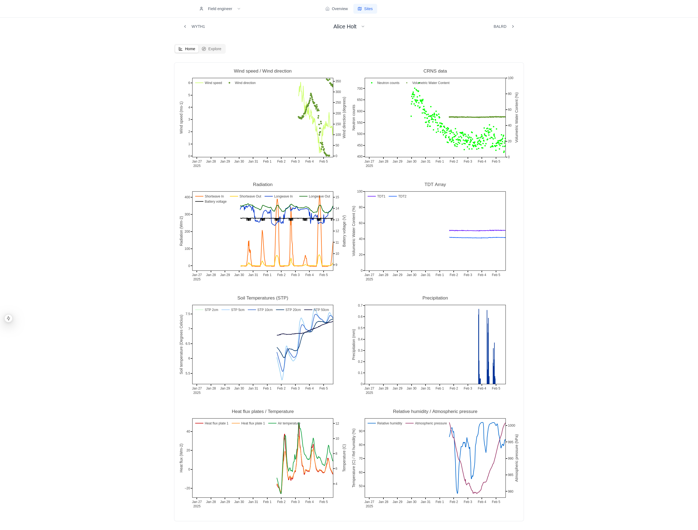

## 2025 Week 6

### Highlights
- New restyled Field Engineer UI with lots of graphs [https://dri-ui.staging.eds.ceh.ac.uk/](https://dri-ui.staging.eds.ceh.ac.uk/)
- Big discussion on the Timeseries Pipeline [Details here](https://cehacuk.sharepoint.com/:p:/r/sites/FDRI-WP2Digital/Shared%20Documents/General/Digital%20infrastructure%20components/Architecture%20and%20candidate%20approaches/FDRI-Architecture-Diagrams/Processing%20Pipeline%20design.pptx?d=w2b55825df04b47c2b38b9e5d2d2e1a24&csf=1&web=1&e=MaBKhl)
- New FDRI Phenocam workstream is starting! (Hollie, Josh, Ola, Dom) [JIRA](https://jira.ceh.ac.uk/secure/RapidBoard.jspa?rapidView=667&projectKey=FW&view=planning&issueLimit=100#)

### EPIC Update

#### Field Engineer UI
Most of the UI has been restyled to look cleaner, and we've added all the graphs we planned to in each site view. The graphs match the existing COSMOS view graph, the field engineers should be used to.

### DRI API
The dri api has been plagued with duckdb bugs, which we have fixed but seem to uncover other bugs. It's been quite frustrating but it's good we span up a data access api now to tackle these unexpected problems early.

### Metadata discovery
Ongoing discovery on how we can integrate with the metadata service created by epimorphics. Some inital discussions on a new workstream for developing a better data api, perhaps using [sensor things api](https://developers.sensorup.com/docs/) spec.

### Flagging
The flagging reworking in the timeseries process has finally been completed and merged to main, huge effort completed here to finish some long running discussions and implementation.

### Technical Debt
Added object keys to failed timeseries ingestion items in dynamodb, which allows for easier recovery from errors.

