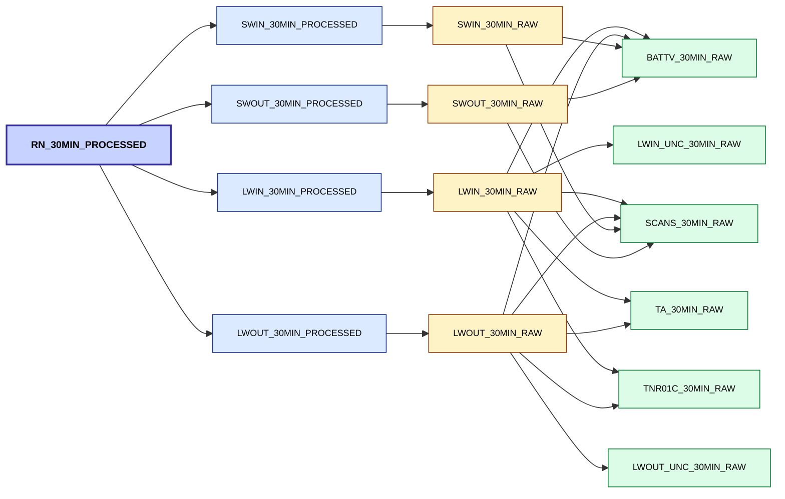

# 011: Metadata-Driven DAG Architecture for Time Series Processing

Status: proposed

Authors: Richard Smith

Date: 2025-10-28

## Context and Problem Statement

The current time series data processing pipeline uses the metadata API to help define the workflows dynamically.
For a given site(s), resolution, and variable(s), it retrieves dataset metadata, identifies dependencies and 
processing configurations, and executes a fixed sequence of steps:

Gather metadata > Load data > Corrections > QC > Infill > Derive / aggregate variables

This approach works well for straightforward datasets with simple dependency chains, but it has two key limitations:

### 1. Shallow dependency traversal
- The current system only follows direct dependencies listed in the dataset metadata.
- Dependencies appearing deeper within configuration files are not recursively resolved.
- This can result in missing prerequisite data or incorrect execution order when dependent variables must first be 
  processed.

A concrete example of this is requesting the processing of **LWIN** (longwave inward radiation). One of the QC checks
for this is called ["nr01temp"](https://dri-metadata-api.staging.eds.ceh.ac.uk/id/data-processing-configuration/cosmos-bunny-lwin_30min_raw-nr01_temp), 
which has a dependency on the **TNR01C** variable. In the current processor, the dependency and configuration 
searching stops here. However, the **TNR01C** variable has its own QC and infilling configurations, with potential 
additional dependencies, that are not gathered.

### 2. Linear processing order
- The pipeline currently runs datasets through a fixed linear stage sequence - there is no mechanism to dynamically 
  reorder tasks based on actual dependency structure
- This model starts to breaks down when, for example, a derived or aggregated variable must be produced *before* it can 
  be used by another variable. An example of this is the daily rainfall, which requires 30 minute rainfall to be 
  aggregated from 1 minute rainfall. Workarounds can be put in place, but this increases the complexity. 

## Considered Options

> [!NOTE]
> I've used AI (ChatGPT, Claude) to help me structure this proposal, and help code a prototype system that provides
> example of it being used.
> 
This proposal outlines a **metadata-driven Directed Acyclic Graph (DAG)** method to orchestrate dataset processing.

**Key Elements of the new approach:**

1. **Recursive Dependency Discovery**
   - Epimorphics have provided a recursive dependency endpoint: `/id/dataset/{id}/_all_dependencies.json`
     - This provides the 'direct' dataset dependencies for a given parent
     - For example, a parent of Net Radiation (RN) would provide the metadata for: SWIN_PROCESSED, SWIN_RAW, 
       SWOUT_PROCESSED, SWOUT_RAW, LWIN_PROCESSED, LWIN_RAW, LWOUT_PROCESSED, LWOUT_RAW
   - Gather dependencies from processing configurations (QC, infill, correction) **and recurse through these to get
     further dependencies**
   - Ensures all datasets required for any process are known

2. **Metadata to Domain Mapping**
   - Pydantic models validate API JSON and are mapped to lightweight domain objects 
     (`TimeSeriesContainer`, `ProcessingConfig`).
   - This is done in the current iteration, however I'm suggesting a stricter pydantic model structure
   - 
3. **DAG Builder**
   - Dependencies are held within a "DAG", allows us to know which datasets are dependents of which
   - Essentially a dictionary of `{parent dataset ID: [dependent1, dependent2, etc]}`
   - Dependents can exist in the list of multiple parent datasets
   - Example visualised for RN:



4. **Topological Sorting**
   - Once we've found all the datasets we need for the requested processing, datasets are ordered using a DAG-based 
     topological sort.
     - Orders the nodes (in this case, each dataset) of the graph so that each node appears only after all the nodes 
       it depends on.   
   - Essentially gives us a list of the dataset IDs in an order that guarantees every dataset is processed after its 
     dependencies are complete
   - Example for RN:

    ```
    === Topological order ===
      http://fdri.ceh.ac.uk/id/dataset/cosmos-bunny-battv_30min_raw
      http://fdri.ceh.ac.uk/id/dataset/cosmos-bunny-lwin_unc_30min_raw
      http://fdri.ceh.ac.uk/id/dataset/cosmos-bunny-scans_30min_raw
      http://fdri.ceh.ac.uk/id/dataset/cosmos-bunny-ta_30min_raw
      http://fdri.ceh.ac.uk/id/dataset/cosmos-bunny-tnr01c_30min_raw
      http://fdri.ceh.ac.uk/id/dataset/cosmos-bunny-lwin_30min_raw
      http://fdri.ceh.ac.uk/id/dataset/cosmos-bunny-lwin_30min_processed
      http://fdri.ceh.ac.uk/id/dataset/cosmos-bunny-lwout_unc_30min_raw
      http://fdri.ceh.ac.uk/id/dataset/cosmos-bunny-lwout_30min_raw
      http://fdri.ceh.ac.uk/id/dataset/cosmos-bunny-lwout_30min_processed
      http://fdri.ceh.ac.uk/id/dataset/cosmos-bunny-swin_30min_raw
      http://fdri.ceh.ac.uk/id/dataset/cosmos-bunny-swin_30min_processed
      http://fdri.ceh.ac.uk/id/dataset/cosmos-bunny-swout_30min_raw
      http://fdri.ceh.ac.uk/id/dataset/cosmos-bunny-swout_30min_processed
      http://fdri.ceh.ac.uk/id/dataset/cosmos-bunny-rn_30min_processed
    ```

5. **Layered Execution**
   - The topological sorting can be extended to group layers of datasets that can run concurrently.
   - Enables safe parallel or distributed execution.
   - Example for RN:

    ```
    === Topological layer order ===
    
    === Layer 0 ===
      http://fdri.ceh.ac.uk/id/dataset/cosmos-bunny-battv_30min_raw
      http://fdri.ceh.ac.uk/id/dataset/cosmos-bunny-lwin_unc_30min_raw
      http://fdri.ceh.ac.uk/id/dataset/cosmos-bunny-lwout_unc_30min_raw
      http://fdri.ceh.ac.uk/id/dataset/cosmos-bunny-scans_30min_raw
    
    === Layer 1 ===
      http://fdri.ceh.ac.uk/id/dataset/cosmos-bunny-swin_30min_raw
      http://fdri.ceh.ac.uk/id/dataset/cosmos-bunny-swout_30min_raw
      http://fdri.ceh.ac.uk/id/dataset/cosmos-bunny-ta_30min_raw
      http://fdri.ceh.ac.uk/id/dataset/cosmos-bunny-tnr01c_30min_raw
    
    === Layer 2 ===
      http://fdri.ceh.ac.uk/id/dataset/cosmos-bunny-lwin_30min_raw
      http://fdri.ceh.ac.uk/id/dataset/cosmos-bunny-lwout_30min_raw
      http://fdri.ceh.ac.uk/id/dataset/cosmos-bunny-swin_30min_processed
      http://fdri.ceh.ac.uk/id/dataset/cosmos-bunny-swout_30min_processed
    
    === Layer 3 ===
      http://fdri.ceh.ac.uk/id/dataset/cosmos-bunny-lwin_30min_processed
      http://fdri.ceh.ac.uk/id/dataset/cosmos-bunny-lwout_30min_processed
    
    === Layer 4 ===
      http://fdri.ceh.ac.uk/id/dataset/cosmos-bunny-rn_30min_processed
    ```
   
## Consequences

### Positive
- More robust dependency recursion
- Correct execution order for all datasets and configs
- More flexibility in processing order
- Potential for simple parallelisation by layer

### Negative
- Slightly more complex dependency resolution logic (though not even sure about this - potentially it's simpler!)
- Potentially harder to structure logs 

## Links

Example code:

### Components

| Layer                 | Module                                                                                      | Description                                                                |
|-----------------------|---------------------------------------------------------------------------------------------|----------------------------------------------------------------------------|
| **API Models**        | [api_models](../timeseries/snippets/011-Metadata-Drive-DAG-Processor/api_models)            | Pydantic schemas for FDRI metadata (datasets, dependencies, configs)       |
| **Domain Models**     | [domain_models](../timeseries/snippets/011-Metadata-Drive-DAG-Processor/domain_models)      | A more usable data class for holding the metadata + data for a timeseries  |
| **Mappers**           | [mappers](../timeseries/snippets/011-Metadata-Drive-DAG-Processor/mappers/api_to_domain.py) | Extracts essential information from Pydantic objects into the domain model |
| **DAG Builder**       | [dag.py](../timeseries/snippets/011-Metadata-Drive-DAG-Processor/dag.py)                    | Builds and resolves the dependency graph, applies topological sort         |
| **Pipeline Executor** | [pipeline.py](../timeseries/snippets/011-Metadata-Drive-DAG-Processor/pipeline.py)          | Dummy example of executing dataset processing in dependency order          |
| **Entrypoint**        | [main.py](../timeseries/snippets/011-Metadata-Drive-DAG-Processor/main.py)                  | Example runner                                                             |
