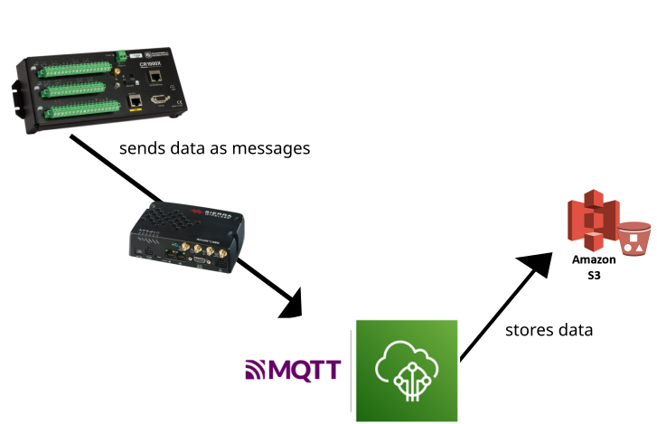
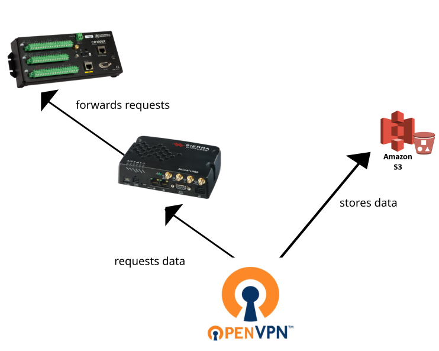

# Networks and services

## Low-bandwidth data via MQTT

Datalogger sends observations to an "MQTT broker". Each set of observations is a document in JSON format. The JSON data is _published_ to an MQTT topic (which is structured like a web URL) and other services can _subscribe_ to that topic and read the messages sent to it.

Datalogger scripts take readings from different sensors at different frequencies - there will be some measurements coming in once a minute, some once every 30 minutes.

In FDRI the MQTT service is provided by Amazon Web Services IoT Core. When new messages is received, there's a [rule](https://docs.aws.amazon.com/iot/latest/developerguide/iot-rules.html) that stores the raw messages in AWS s3 cloud storage. 

> [!NOTE]
> AWS is the [platform chosen by FDRI](https://github.com/NERC-CEH/fdri_words/blob/main/adrs/002-IoT-Telemetry-Ingress.md) for Internet of Things, for ease of management and scaling. There are also [smaller-scale , open source approaches](http://www.steves-internet-guide.com/logging-mqtt-sensor-data/) to doing the same thing.

We use a secure, encrypted version of MQTT, AWS IoT helps manage certificates for devices which support them to authenticate with, this includes Campbell dataloggers. There's also a route for devices which can't or won't do certificate-based authentication to use a username and password to connect to an MQTT broker.

### Implications for FDRI Infrastructure

Each field device needs the address of the MQTT broker in an AWS account. Please see the [campbell-mqtt-control](https://github.com/NERC-CEH/campbell-mqtt-control/) project for detail of remotely configuring settings on a Campbell datalogger via MQTT.

## High-bandwidth data via direct download

MQTT is designed for "Internet of Things" services and not for high-bandwidth data at large volumes. 

In FDRI we have set up a VPN to provide direct access to automate downloading data from field devices and storing it directly in s3. The [Architectural Decision Record](https://github.com/NERC-CEH/fdri_words/blob/b7b511a210a5eac5a112d2f157767ad9b4456828/017-Flux-Raw-Data-Transfer-Method.md) provides some background to why it's done this way, and what else was tried.

4G routers at field sites are connected to a VPN, and can be configured to forward requests through to dataloggers. This means we have direct access to a field site network from within one of the UKCEH office networks, and can e.g. set up scheduled processes to collect data hourly.
 
### Implications for FDRI Infrastructure

The server which runs the scheduled pipeline to collect data from field devices needs credentials to write to s3 in the correct AWS account (access keys, role to assume, and bucket name). Please see the [fdri_field_access](https://github.com/NERC-CEH/fdri_field_access) project for detail of how this is set up.

 
