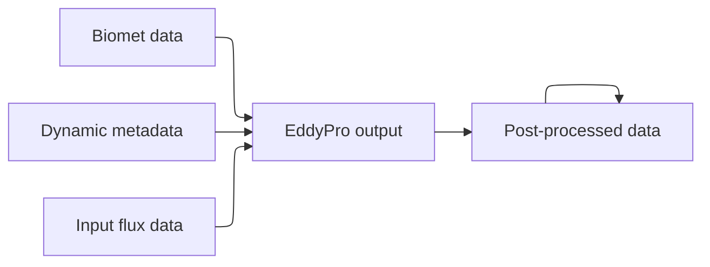
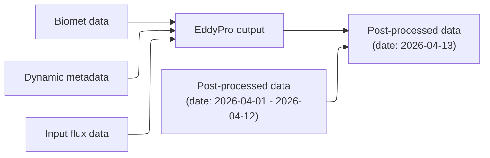

# Post-processing

## Background

The post-processing of the output EddyPro files has been defined as scripts in [this repository][post-processing-repo].
We have to decide whether and how to integrate it into the pipeline run through AWS, which is currently all part of the [timeseries-processor][].
One potential issue is that the de-spiking step requires 13 days of previous data to establish upper and lower bounds.
This may not fit in well with the architecture of the timeseries-processor, which builds a DAG (directed acyclic graph) of dataset dependencies required for processing.
A dataset depending on itself (even only for previous days) is a cycle, incompatible with the acyclic model.

[post-processing-repo]: https://github.com/mattjbr123/eddypro_output_processor
[timeseries-processor]: https://github.com/NERC-CEH/dri-timeseries-processor

## Potential solutions

### Fully integrated into timeseries-processor

This is overall a preferable solution, but requires a solution to the cycle issue.
One solution might be to augment the nodes of the DAG with the time range they refer to.

Consider the following:

With the self-dependency, this is no longer a DAG.
If we refine the nodes to include the date, we get this:

No more cycles!

"Undated" references would be considered to match all data,
and we'd need to make sure that dates for which the dataset doesn't exist or have any data are handled properly.

Pros:

- Solution to datasets depending on themselves may have applications for other cases in the future
- Avoids separate system to trigger and run

Cons:

- Requires transplanting post-processing from separate repo into timeseries-processor
- Complex change to dependency resolution

### Separate processing step

The post-processing is already packaged as a runnable Python script.
It would therefore be reasonably straightforward just to package it up into a Docker image and run it as part of the pipeline.

Pros:

- Unnecessary to make tricky DAG changes

Cons:

- Need some way to trigger runs
- More complicated to deploy operationally
