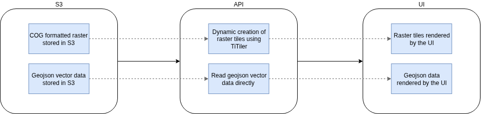

# Geospatial API design

For the FDRI project there is a requirement to be able to easily visualise geospatial data, predominantly stored in raster and vector formats.

In order to be able to display raster data on a UI it must be split into tiles, which are then served via an API. There are many ways to do this, but the options can be split into two categories - serving pre-generated raster tiles, or dynamically creating the raster tiles from a single raster file.

As one of the ideas behind the design of the geospatial API is to create something that will not only accomodate all FDRI geospatial requirements, but is also able to be easily re-used for any other projects that may need to display and interact with geospatial data.

With this in mind, dynamically generating tiles from raster data stored in S3 appeared to be the most
flexible solution. Not only would it mean a single raster is stored in S3 instead of hundreds of thousands of tiny image tiles, but also provides the ability to download the raw raster data directly from S3 if needed, as TiTiler (the main library supporting dynamic tile generation) has the ability to colourise a raster during the tile generation process. However dynamic colourisation does slow down the API response, so it may be better to store a pre-colourised version of the raster data. 

## Current implementation structure

### Data requirements

#### Raster

In order for a raster to be easily displayed using TiTiler, it must be formatted to have the following attributes

- Reprojected into EPSG 3857 (world mercator projected equivalent to WGS84)
- Colourisation applied
- Converted to a COG formatted raster
- Any corresponding legend data generated and stored alongside the raster (this is still a work in progress)

#### Vector

A number of UI libraries are capable of rendering vector data directly, the requirements for formatting the vector data are:

- Reprojected into EPSG 4326 (WGS84)
- Converted to geojson format
- Any very complex geometries are simplified (but not to the point where accuracy of the geometry is reduced when viewed on the UI)

### Linking data on S3 to the UI via an API

A basic FastAPI instance is used to find the data stored in S3, undertake any processing to make the data easily renderable, before passing it out to the UI.

TiTiler is used to dynamically create raster tiles (generally png images of the raster at various zoom levels) as they are requested by the UI. This avoids hundreds of thousands of tiny png files needing to be stored either on S3 or in a database somewhere. 

#### Endpoints

There are three main endpoints to the data (see https://dri-geospatial-api.staging.eds.ceh.ac.uk/api/docs for the documentation):

- **/available_data** Lists the data found in the geospatial data bucket on S3 alongside it's data type (raster or vector). It is likely the underlying logic, and data format returned by this endpoint will change once as the requirements for the data become clearer (e.g. how the data is categorised for easy navigation and display).
- **/maps/tiles/** This endpoint (and it's various variations) requests dynamic raster tiles generated by TiTiler and serves them to the UI. The urls are often in the format of /maps/tiles/{tileMatrixSetId}/{z}/{x}/{y}.png?url={s3Url}. For example http://localhost:8000/api/maps/tiles/WebMercatorQuad/16/32261/21043.png?url=S3://ukceh-fdri-staging-geospatial/raster/test_raster_3857_cog_rendered.tif.
- **/vector** Reads data from the requested vector file from S3 and returns it as a geojson object, ready to be rendered directly by the UI.

## Still in progress / yet to be decided

Some kind of database is needed to be able to store additional metadata surrounding the geospatial data. For example, the bounding box, or more accurate bounding geometry for the raster, any legend information, min/max zoom levels supported by the raster's resolution etc. The type and structure of this database has yet to be decided. 
