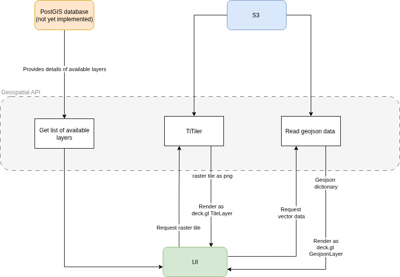
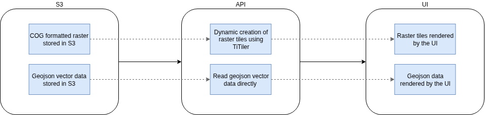

# Geospatial API design

For the FDRI project there is a requirement to be able to easily visualise geospatial data, predominantly stored in raster and vector formats.

In order to be able to display raster data on a UI it must be split into tiles, which are then served via an API. There are many ways to do this, but the options can be split into two categories - serving pre-generated raster tiles, or dynamically creating the raster tiles from a single raster file.

As one of the ideas behind the design of the geospatial API is to create something that will not only accomodate all FDRI geospatial requirements, but is also able to be easily re-used for any other projects that may need to display and interact with geospatial data.

With this in mind, dynamically generating tiles from raster data stored in S3 appeared to be the most
flexible solution. Not only would it mean a single raster is stored in S3 instead of hundreds of thousands of tiny image tiles, but also provides the ability to download the raw raster data directly from S3 if needed, as TiTiler (the main library supporting dynamic tile generation) has the ability to colourise a raster during the tile generation process. However dynamic colourisation does slow down the API response, so it may be better to store a pre-colourised version of the raster data.

## Current implementation structure

### Data requirements

More details of data requirements can be found in the separate file: [geospatial_data_types](geospatial_data_types.md)

#### Raster

In order for a raster to be easily displayed using TiTiler, it must be formatted to have the following attributes

- Reprojected into EPSG 3857 (world mercator projected equivalent to WGS84)
- Colourisation applied
- Converted to a COG formatted raster
- Any corresponding legend data generated and stored alongside the raster (this is still a work in progress)

#### Vector

A number of UI libraries are capable of rendering vector data directly, the requirements for formatting the vector data are:

- Reprojected into EPSG 4326 (WGS84)
- Converted to geojson format
- Any very complex geometries are simplified (but not to the point where accuracy of the geometry is reduced when viewed on the UI)

### Linking data on S3 to the UI via an API

A basic FastAPI instance is used to find the data stored in S3, undertake any processing to make the data easily renderable, before passing it out to the UI.

TiTiler is used to dynamically create raster tiles (generally png images of the raster at various zoom levels) as they are requested by the UI. This avoids hundreds of thousands of tiny png files needing to be stored either on S3 or in a database somewhere.

#### Endpoints

There are three main endpoints to the data (see https://dri-geospatial-api.staging.eds.ceh.ac.uk/api/docs for the documentation):

- **/available_data** Lists the data found in the geospatial data bucket on S3 alongside it's data type (raster or vector). It is likely the underlying logic, and data format returned by this endpoint will change once as the requirements for the data become clearer (e.g. how the data is categorised for easy navigation and display).
- **/maps/tiles/** This endpoint (and it's various variations) requests dynamic raster tiles generated by TiTiler and serves them to the UI. The urls are often in the format of /maps/tiles/{tileMatrixSetId}/{z}/{x}/{y}.png?url={s3Url}. For example http://localhost:8000/api/maps/tiles/WebMercatorQuad/16/32261/21043.png?url=S3://ukceh-fdri-staging-geospatial/raster/test_raster_3857_cog_rendered.tif.
- **/vector** Reads data from the requested vector file from S3 and returns it as a geojson object, ready to be rendered directly by the UI.

## Potential database design

### Main table

A registry of layers, containing a spatial index is required. An initial design for the main table is as follows:

| Column Name             | Required? | Description / Notes                                                                                                                                                                  |
| ----------------------- | --------- | -------------------------------------------------------------------------------------------------------------------------------------------------------------------------------------|
| ID                      | Required  | Primary key created by the database                                                                                                                                                  |
| Name                    | Required  | Used for displaying the name in the UI                                                                                                                                               |
| Project                 | Required  | FDRI/ NC-UK etc – Links to project table                                                                                                                                             |
| Date                    | Required  |                                                                                                                                                                                      |
| Source type             | Required  | Links to the SourceType table to provide information about where the data is coming from (e.g. S3, metadata api etc)                                                                 | 
| Raw Source id           | Optional  | The S3 key, catalogue identifier etc to point the API to the raw data (if available). This should be the singleband EPSG 3857 COG tif or any vector (geojson) data.                  |
| Colour Source id        | Optional  | The S3 key, catalogue identifier etc to point the API to the colourised data (if available). It's expected this will be a cog formatted colourised raster, or a WMS source.          |
| Data format             | Required  | Raster / vector etc. Links to the DataFormat database table                                                                                                                          |
| Data category           | Required  | DOM / DEM etc. Links to the DataCategory database table.                                                                                                                             |                                                                                                                                                              |
| Legend (JSON)           | Optional  | Required for raster data only. For vector data the legend will be stored per feature                                                                                                 |
| Boundary                | Optional  | Simplified boundary in WGS84 to allow for location queries                                                                                                                           |
| Bounding box (bbox)     | Required  | Bounding box (in WGS84) of the layer stored as a geometry (not a list of 4 floats)                                                                                                   |
| Catalogue id            | Optional  | If download is available in the catalogue. Partial url to catalogue page – maybe just unique ID we can use to construct the URL?                                                     |
| Processing level        | Required  | Links to the ProcessingLevel database table. Aims to identify whether data is raw or processed.                                                                                      |
| AreaName                | Required  | Links to the AreaName database table. Defines the area name (e.g. Chess) which links to the AreaType (e.g. Catchment).                                                               |

### Project table - project metadata and data categorisation

Stores the project ids and unique project specific parameters. For example FDRI may want to categorise data based on
the region, data type and date range, whereas a different project may want to categorise based on data type and
resolution. The project metadata can then be used to derive the S3 structure.

The project table could have the following fields (likely to be expanded):

| Column Name | Required? | Description / Notes                                      |
| ----------- | --------- | -------------------------------------------------------- |
| ID          | Required  | Primary key created by the database                      |
| Object key  | Required  | Used as a unique ID for easily finding the correct item. |                                                                                                                                                                                                   |
| Name        | Required  | Used for displaying the name in the UI                   |

### Data Format table

This links to the data_format field in the main table and stores standardised data types, such as "raster" and "vector".

| Column Name | Required? | Description / Notes                                      |
| ----------- | --------- | -------------------------------------------------------- |
| ID          | Required  | Primary key created by the database                      |
| Object key  | Required  | Used as a unique ID for easily finding the correct item. |                                                                                                                                                                                                   |
| Name        | Required  | Used for displaying the name in the UI                   |

### Data Category 

This links to the data_category field in the main Layer table, and stores the category of the data, for example DEM etc

| Column Name | Required? | Description / Notes                                      |
| ----------- | --------- | -------------------------------------------------------- |
| ID          | Required  | Primary key created by the database                      |
| Object key  | Required  | Used as a unique ID for easily finding the correct item. |                                                                                                                                                                                                   |
| Name        | Required  | Used for displaying the name in the UI                   |

### Source type

This links to the source_type field in the main Layer table, and stores information about where the layer is being 
sourced from. For example from S3 or the metadata api. 

| Column Name | Required? | Description / Notes                                                                                                          |
| ----------- | --------- | ---------------------------------------------------------------------------------------------------------------------------- |
| ID          | Required  | Primary key created by the database                                                                                          |
| Object key  | Required  | Used as a unique ID for easily finding the correct item.                                                                     |                                                                                                                                                                                                   |
| Name        | Required  | Used for displaying the name in the UI                                                                                       |
| Base url    | Required  | The base url used for constructing the full source url. E.g. "s3://geospatial_data_bucket" or "https://catalogue.ceh.ac.uk/" |

### Processing Level

This links to the processing_level field in the main Layer table, and stores the processing level of the data, for example Raw, Processed etc.

| Column Name | Required? | Description / Notes                                      |
| ----------- | --------- | -------------------------------------------------------- |
| ID          | Required  | Primary key created by the database                      |
| Object key  | Required  | Used as a unique ID for easily finding the correct item. |                                                                                                                                                                                                   |
| Name        | Required  | Used for displaying the name in the UI                   |

### Area Name

This links to the area_name field in the main Layer table, and stores details about the location associated with the layer.
Its use case is to create instances of different area types, each with a unique name that can be easily associated with
multiple layers without risking duplication due to typos (e.g. one layer referred to as "chess", another as "Chess", another as "Chess Catchment" etc)
This table stores the name to use for the area associated with the layer, and links to the type of area it corresponds to.

| Column Name | Required? | Description / Notes                                      |
| ----------- | --------- | -------------------------------------------------------- |
| ID          | Required  | Primary key created by the database                      |
| Object key  | Required  | Used as a unique ID for easily finding the correct item. |                                                                                                                                                                                                   |
| Name        | Required  | Used for displaying the name in the UI                   |
| Area type   | Required  | Links to the AreaType table                              |

### Area Type

This links to the area_type field in the AreaName table, and stores details type of location. Predominantly the type of 
area, such as whether the data is expected to cover a catchment, or is at a national level.

| Column Name | Required? | Description / Notes                                      |
| ----------- | --------- | -------------------------------------------------------- |
| ID          | Required  | Primary key created by the database                      |
| Object key  | Required  | Used as a unique ID for easily finding the correct item. |                                                                                                                                                                                                   |
| Name        | Required  | Used for displaying the name in the UI                   |

## Still in progress / yet to be decided

The method for serving vector data too large to be sent via API still needs to be determined. Some form of vector tiles
seems promising as it would allow feature selection within the UI. The alternative is to use WMS, however this does
effectively render the vector as a static image, removing any interactive capabilities.

