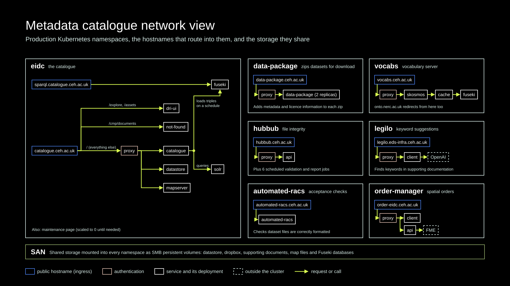

# Metadata Catalogue Network View

High-level view of the metadata catalogue Kubernetes cluster.



## Overview

Each namespace is an outlined box. Public hostnames (ingresses) are outlined in blue, proxies in pink, and services
outside the cluster are dashed. Each service is drawn together with its deployment, because they are one-to-one in
every namespace.

All hostnames, including catalogue.ceh.ac.uk and vocabs.ceh.ac.uk, are now served by the Kubernetes cluster.

The hostnames still sit under several domains (ceh.ac.uk, eds-infra.ceh.ac.uk and nerc.ac.uk). Consolidating them
under a single domain is a planned future improvement. This would likely be done by replacing the ingress controller
with a Gateway API implementation.

## Storage

The underlying SAN is mounted into every namespace as SMB persistent volumes, several times over, to give common
access to storage: the datastore, dropbox, supporting documents, map files and the vocabulary Fuseki databases. Most
namespaces use the SMB CSI driver; legilo, automated-racs and order-manager still use the older flexVolume driver.

## Each namespace
### eidc

sparql.catalogue.ceh.ac.uk is a Fuseki instance containing triples describing the public metadata records.
Triples are generated from the catalogue and loaded into Fuseki on a schedule.

catalogue.ceh.ac.uk routes by path. `/explore` and `/assets` go to `dri-ui`, which displays the spatial and file
preview explorers. `/cmp/documents` goes to `not-found`. Everything else goes to the `proxy`, which manages
authentication for user access to the catalogue.

The catalogue is made up of the `catalogue` Java application and `solr` as the main components; the catalogue queries
Solr directly. `datastore` provides direct access to the datasets. `mapserver` provides access to the spatial data,
i.e. web map services. A `maintenance` page is kept scaled to zero until it is needed.

### automated-racs

Automated resource acceptance checks (RACS), used by the data centre staff to check
that dataset files are correctly formatted.

### data-package

A Java application, running as two replicas, that packages datasets into a zip file with the metadata and licence
information.

### hubbub

Maintains the integrity of the dataset files by checking that the file hashes match.
API provides file-level information about each dataset, used, for example, by the
file preview explorer in the catalogue `dri-ui` or to generate Croissant formatted
metadata records. Six scheduled jobs run validation, clean-up and reporting.

### legilo

Suggests keywords and observed properties for the metadata editor from the supporting documentation, using the
OpenAI API.

### order-manager

Subset spatial datasets ordered by users. Has a Java application for the API and a
React application for the frontend. The API interacts with FME to do the spatial
transformation. FME will be replaced soon as the licence is too expensive.

### vocabs

Skosmos instance as frontend for the vocabularies. Vocabularies are loaded from the
Fuseki instance, through a Varnish cache.

Proxy used to protect draft vocabularies from public access. The namespace also redirects onto.nerc.ac.uk.

## Updating the diagram

The diagram is generated by [`catalogue-network.py`](catalogue-network.py) in UKCEH brand colours, and was checked
against the production manifests in `k8s-eds-prod`. Edit the script and regenerate with:

```
uv run --with pillow python catalogue-network.py
```

The script stops with an error, rather than drawing overlapping boxes, if a chain of services no longer fits its box.
