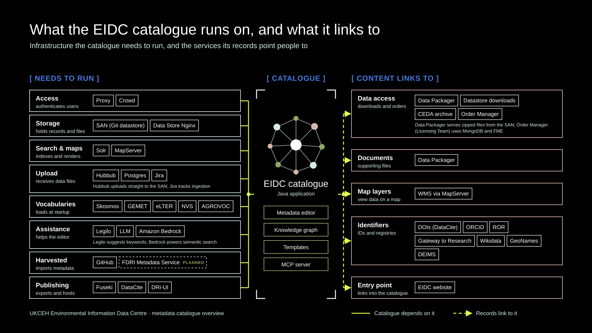

# Metadata Catalogue Overview
A high-level overview of the servers and services the EIDC metadata catalogue needs to run, and the services its
records link to.



## Needs to run

Services the catalogue depends on to operate.

- **Access.** The Proxy controls access to the catalogue and provides authentication and user registration. Crowd
provides combined user and group management.
- **Storage.** Metadata records are kept in a Git datastore on the SAN. The catalogue uploads files directly to the
datastore dropbox, served by Data Store Nginx.
- **Search & maps.** Solr indexes metadata documents and the vocabularies the metadata editor needs. MapServer
provides Web Map Service (WMS) editing and display.
- **Upload.** Hubbub handles file upload and management, uploading files directly to the SAN; its data is stored in
Postgres. Jira integrates with the file upload process during ingestion.
- **Vocabularies.** The editor loads vocabularies at startup from the Skosmos vocabulary server and from external
sources: GEMET, eLTER, the NERC Vocabulary Server (NVS) and AGROVOC.
- **Assistance.** Legilo provides analysis services to the metadata editor, using an LLM to find keywords and
observed properties in the supporting documentation. Amazon Bedrock generates the embeddings behind semantic search.
- **Harvested.** The editor imports method metadata from GitHub citation files. Harvesting from the FDRI Metadata
Service is planned.
- **Publishing.** All public metadata records are exported to the Fuseki triple store. DOIs are registered with
DataCite. DRI-UI hosts new user interface elements such as the Spatial Explorer and Data Preview.

## Content links to

Services that metadata records point people to.

- **Data access.** Records link to datasets hosted by Data Packager, which serves zipped files from the SAN, and to
datastore downloads and the CEDA archive. Some records use Order Manager for order processing, managed by the
Licensing Team; Order Manager stores its data in MongoDB and uses FME for job management.
- **Documents.** Supporting documentation is served by Data Packager.
- **Map layers.** Records link to WMS map layers served by MapServer.
- **Identifiers.** Records link to persistent identifiers and registries: DOIs (DataCite), ORCID, ROR, Gateway to
Research, Wikidata, GeoNames and DEIMS.
- **Entry point.** The EIDC website is the entry point to the catalogue.

## Updating the diagram

The diagram is generated by [`catalogue-overview.py`](catalogue-overview.py) in UKCEH brand colours. Each group is a
row in its `LEFT` or `RIGHT` list; edit the list and regenerate with:

```
uv run --with pillow python catalogue-overview.py
```
