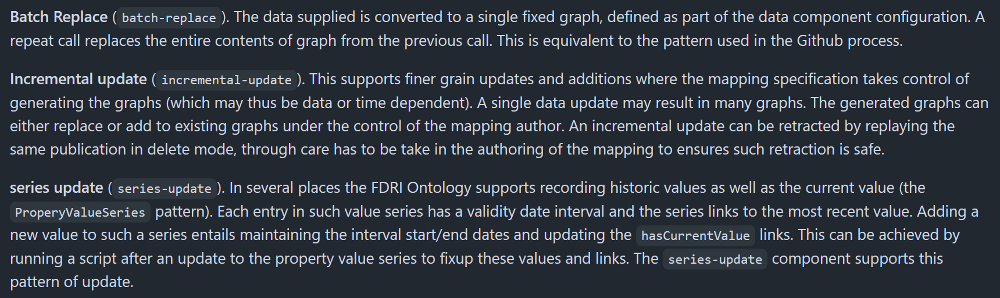

The [metadata-ingest](https://github.com/NERC-CEH/dri-metadata-ingest) tool allows changes to be made to the metadata API via a POST request. There is a [user guide](https://github.com/NERC-CEH/dri-metadata-ingest/blob/main/doc/user_guide.md) for the tool, but I have tried to summarise the process here.

Alongside the tool, there is a [metadata-ingest-config](https://github.com/NERC-CEH/dri-metadata-ingest-config) repo that manages the configuration for any requests sent to the metadata-ingest tool.

## Making a change to the metadata store

We currently have two metadata stores: `staging` and `dev`. These each have separate namespaces in the cluster (`metadata-service` and `metadata-service-dev` respectively). All testing of changes **should** be done on the `dev` service before made available to the `staging` service.

There are quite a few steps involved - the first involves creating a PR containing the following:

### Create a template

Probably the hardest step that will likely involve epimorphics at the beginning. There are a couple of examples [here](https://github.com/NERC-CEH/dri-metadata-ingest-config/tree/staging/config/template) that you might be able to extract bits of template from.

The template defines how the data will be stored in the triple store, and what graph(s) the data will sit in.

### Create a config

Once the template is in place, we can create an entry in the [config.yaml](https://github.com/NERC-CEH/dri-metadata-ingest-config/blob/staging/config/config.yml) which points to the template to use. It also defines the data source type (has to be `csv` or `jsonlines`), the expected properties in the data and the type of change you want to make (`batch-replace`, `incremental-update`, `series-update`)



Either merge the branch into `dev` or `staging` (based on whether you are testing or have tested). This will copy the config onto the respective buckets ready to be picked by the ingest tool when we post a request.

- [ukceh-fdri-staging-dev-metadata-state](https://eu-west-2.console.aws.amazon.com/s3/buckets/ukceh-fdri-staging-dev-metadata-state?region=eu-west-2&prefix=metadata-service/dri-metadata-ingest/dev/&showversions=false)
- [ukceh-fdri-staging-metadata-state](https://eu-west-2.console.aws.amazon.com/s3/buckets/ukceh-fdri-staging-metadata-state?region=eu-west-2&prefix=metadata-service/dri-metadata-ingest/staging/&showversions=false)

### Create the source data

Build the source data you want to send to the store. This needs to be either `csv` or `jsonlines`.

### Make the request

We can now make the POST request to update the metadata store. When running locally we need to port forward the `ms-ingester` service so its accessible outside of the cluster. This should either be the `dev` or `staging` service.

```
kubectl -n metadata-service port-forward svc/ms-ingester 8000:8000
kubectl -n metadata-service-dev port-forward svc/ms-ingester 8000:8000
```

To make a request use the following curl command. Make sure that

- the header matches the source data type
- the filepath to the source data has been updated
- the correct component has been selected (this is `nrfa-batch` below and correponds to the component name you set in the `config.yml`)

```
curl -X POST -H "Content-Type: application/jsonlines" --data-binary '@./source_data/nrfa_batches.jsonl' "localhost:8000/api/nrfa-batch/publish"
```

It is advised to do a `dry_run` first which will provide a zipfile with some logs and outputs for checking

```
curl -X POST -H "Content-Type: application/jsonlines" --data-binary '@./source_data/nrfa_batches.jsonl' -o test_result.zip "localhost:8000/api/nrfa-batch/publish?dryrun=true"

You can also run the request in delete mode

```
curl -X POST -H "Content-Type: application/jsonlines" --data-binary '@./source_data/nrfa_batches.jsonl' "localhost:8000/api/nrfa-batch/publish?delete=true"
```
The status of any request to the metadata-ingest tool can be found in the `ms-ingester` pod.

Everytime a request is made, the information is stored in the buckets above named `xxxxx-destination`. This is essentially the output from the `dry_run`.

The status of the request can be checked in the fuseki pod. You should see something along the lines of "The SPARQL query has been successfully processed..."

