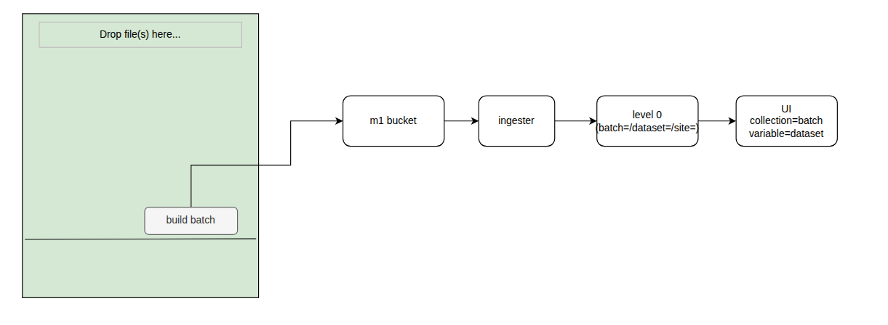
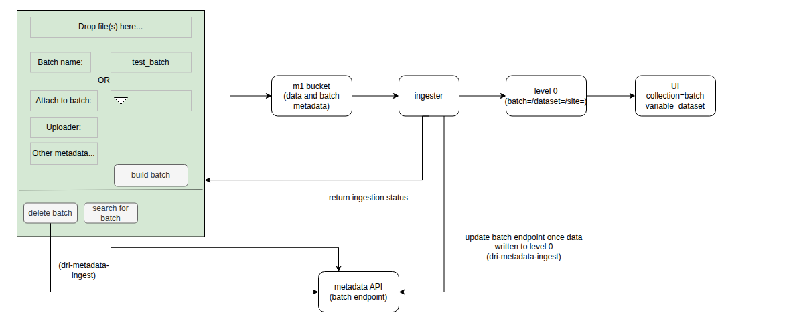

### 2025.10.03 NRFA Batch management system design discussion

We discussed the technical aspects of building the architecture that would allow the NRFA team to upload data into a batch, ingest it and view the data in the UI. It was decided to have several iterations of the product we would like to build; starting with the MVP then adding additional functionality.

## First iteration - single file

- The user can upload a single file on the front end to be sent to the ingester.
- The batch name will be created in the ingester
- The data should be available to view in the UI.

## Second iteration - multiple files and metadata

- The user can upload multiple files for the same batch
- The user can enter their own batch name and some other metadata for the batch
- Data and metadata zipped and sent to the ingester
- Batch metadata added to the metadata API.
- Data available to view in the UI.

## Third iteration - Extra batch management functionality, ingestion success/failure recorded

- The user search for batches, add to an existing batch and delete batches.
- The front end can display any appropriate log messages for an upload. These can be sent to s3 from the ingester.

## Fourth iteration - Basic auth and processing a batch

- Only certain people within the NRFA team can access / upload data
- The user can pick a batch and process it (processing steps TBC)

