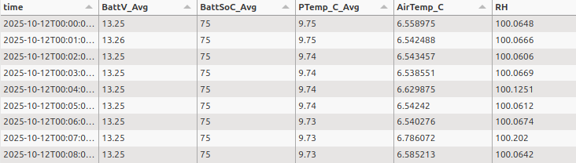

# 2025.11.05 Potential process for sensor deployment

We discussed the potential process for sensor deployment, from the initial setup of the logger and sensors at
Wallingford for testing, through to it's deployment at it's field location.

## Table of contents

1. [Overview of the Existing Process](#overview-of-existing-process)
2. [Proposed New Process](#proposed-new-process)
3. [Next Steps](#next-steps)

## Overview of the Existing Process

The description of the existing process below does not distinguish between a logger deployed into the field and a logger
being tested at Wallingford.

### 1. Messages are sent by the logger

The messages are sent from the logger and detected by AWS IoT core. These are saved in the S3 minus 1 bucket:
`ukceh-fdri-staging-timeseries-level-m1`

### 2. Messages are ingested

The ingestion app detects the presence of new messages in the minus 1 S3 bucket and processes them, saving them in the
level 0 S3 bucket (`ukceh-fdri-staging-timeseries-level-0`) with the following structure

`s3://ukceh-fdri-staging-timeseries-level-0/fdri/dataset=one_minute/site=SITE_1/date=2025-10-13/data.parquet`

Where:

- `fdri` is the network
- `dataset=one_minute` is the dataset (collection in the UI). This is also used to indicate the resolution of the data
- `site=SITE_1` is the ID of the site

This S3 structure is used by the API both to find the correct data to return to the UI, and to list available sites and
and variables. The available variables are determined by reading the parquet files and using the column names
(excluding `time`) as the variable ids. An example of the parquet file contents can be seen below:



### 3. Ingested data is made available in the UI using the data api

There are two ways the data API can determine what data is available to display. Firstly by interrogating the level 0
S3 bucket structure and parquet file contents (commonly referred to as duckdb). Secondly by using the Metadata API

The UI requires the following data in order for users to select data and the API to fetch it:

- The available site IDs (where the site id matches the `site=` part of the S3 file structure)
- The collection (where the id matches the `dataset=` part of the S3 file structure)
- The variable(s) (where the id matches the name of one or columns in the parquet file)

#### Duck DB

Using DuckDB, the S3 bucket structure is analysed to extract the site ID, dataset (collection in the UI), and available
date ranges. The indvidual parquet files are also read to determine the variables available using the column headers.

Whilst no information on site location or the units for each variable, DuckDB provides all the core information required
for the UI to work and the API to fetch data. This core information can be combined with that provided from the Metadata
API in scenarios where not all required information is available from the Metadata API.

#### The Metadata API

The following endpoints are used to provide information for the API to use.

##### Site IDs

https://dri-metadata-api.staging.eds.ceh.ac.uk/id/network/fdri.json?_projection=contains.label%2Ccontains.comment%2Ccontains.hasGeometry

This returns a list of available site ids. Each entry should contain:

- The ID of the site (e.g. `se-hafrf-07`) which should match the `site=` part of the S3 file structure 
  (e.g. `site=se-hafrf-07`)
- The display name of the site (e.g. `Severn Trap (Hafren Forest)`) which provides a more human readable identifier for 
  the site in the UI
- The location of the site (e.g. `POINT(-3.69043706, 52.47060072)`) which is currently only used to display the 
  location of the site in the map view (e.g. https://dri-ui.staging.eds.ceh.ac.uk/fdri/sites?view=map)

<summary>Example response data</summary>
<details>

```
{
  "meta": {
    "@id": "http://fdri.ceh.ac.uk/id/network/fdri.json?_projection=contains.label%2Ccontains.comment%2Ccontains.hasGeometry.%2A",
    "publisher": "UK Centre for Ecology & Hydrology",
    "license": "http://www.nationalarchives.gov.uk/doc/open-government-licence/version/3/",
    "licenseName": "OGL 3",
    "comment": "",
    "version": "1.0.0",
    "hasFormat": [
      "http://fdri.ceh.ac.uk/id/network/fdri.json?_projection=contains.label%2Ccontains.comment%2Ccontains.hasGeometry.%2A",
      "http://fdri.ceh.ac.uk/id/network/fdri.ttl?_projection=contains.label%2Ccontains.comment%2Ccontains.hasGeometry.%2A",
      "http://fdri.ceh.ac.uk/id/network/fdri.csv?_projection=contains.label%2Ccontains.comment%2Ccontains.hasGeometry.%2A",
      "http://fdri.ceh.ac.uk/id/network/fdri.html?_projection=contains.label%2Ccontains.comment%2Ccontains.hasGeometry.%2A",
      "http://fdri.ceh.ac.uk/id/network/fdri.rdf?_projection=contains.label%2Ccontains.comment%2Ccontains.hasGeometry.%2A",
      "http://fdri.ceh.ac.uk/id/network/fdri.geojson?_projection=contains.label%2Ccontains.comment%2Ccontains.hasGeometry.%2A"
    ]
  },
  "items": [
    {
      "@id": "http://fdri.ceh.ac.uk/id/network/fdri",
      "contains": [
        {
          "@id": "http://fdri.ceh.ac.uk/id/site/fdri-se-hafrf-07",
          "label": [
            "Severn Trap (Hafren Forest)"
          ],
          "hasGeometry": [
            {
              "@id": "http://fdri.ceh.ac.uk/id/site/fdri-se-hafrf-07#geo-latlong",
              "asWKT": "POINT(-3.69043706, 52.47060072)",
              "@type": [
                {
                  "@id": "http://www.opengis.net/ont/geosparql#Geometry"
                }
              ]
            }
          ]
        },
        {
          "@id": "http://fdri.ceh.ac.uk/id/site/fdri-se-carwe-01",
          "label": [
            "Carreg Wen"
          ],
          "hasGeometry": [
            {
              "@id": "http://fdri.ceh.ac.uk/id/site/fdri-se-carwe-01#geo-latlong",
              "asWKT": "POINT(-3.72671814, 52.48277697)",
              "@type": [
                {
                  "@id": "http://www.opengis.net/ont/geosparql#Geometry"
                }
              ]
            }
          ]
        }
      ]
    }
  ]
}
```

</details>

##### Site Variables

On a per-site basis this endpoint returns details of all available variables for a particular site ID

https://dri-metadata-api.staging.eds.ceh.ac.uk/id/site/fdri-se-carwe-01/_datasets.json?_projection=observedProperty%28prefLabel%29%2Ctype%28prefLabel%29%2Cmeasure%28hasUnit.prefLabel%29%2CsourceColumnName%2Cmeasure%28aggregation%28valueStatistic%28prefLabel%29%29%29%2Cmeasure%28aggregation%28resolution%29%29&%40type=http%3A%2F%2Ffdri.ceh.ac.uk%2Fvocab%2Fmetadata%2FTimeSeriesDataset&processingLevel=http%3A%2F%2Ffdri.ceh.ac.uk%2Fref%2Fcommon%2Fprocessing-level%2Fraw

It should provide:

- The ID of the variable which must correspond to a column name within the parquet file (e.g, `G2`)
- The display name to use for the variable in the UI (e.g. `Soil heat flux`)
- The units for the variable (e.g. `wm-2`)

<summary>Example response data. This example is for a cosmos site instead of FDRI, and the response has been 
trimmed to a single variable item for brevity</summary>
<details>

```
{
  "meta": {
    "@id": "http://fdri.ceh.ac.uk/id/site/cosmos-alic1/_datasets.json?@type=http://fdri.ceh.ac.uk/vocab/metadata/TimeSeriesDataset&processingLevel=http://fdri.ceh.ac.uk/ref/common/processing-level/raw&measure.aggregation.resolution=PT30M&_projection=observedProperty(prefLabel),type(prefLabel),measure(hasUnit.prefLabel),sourceColumnName,measure(aggregation(valueStatistic(prefLabel))),measure(aggregation(resolution))",
    "publisher": "UK Centre for Ecology & Hydrology",
    "license": "http://www.nationalarchives.gov.uk/doc/open-government-licence/version/3/",
    "licenseName": "OGL 3",
    "comment": "",
    "version": "1.0.0",
    "hasFormat": [
      "http://fdri.ceh.ac.uk/id/site/cosmos-alic1/_datasets.geojson?@type=http://fdri.ceh.ac.uk/vocab/metadata/TimeSeriesDataset&_projection=observedProperty(prefLabel),type(prefLabel),measure(hasUnit.prefLabel),sourceColumnName,measure(aggregation(valueStatistic(prefLabel))),measure(aggregation(resolution))&measure.aggregation.resolution=PT30M&processingLevel=http://fdri.ceh.ac.uk/ref/common/processing-level/raw",
      "http://fdri.ceh.ac.uk/id/site/cosmos-alic1/_datasets.ttl?@type=http://fdri.ceh.ac.uk/vocab/metadata/TimeSeriesDataset&_projection=observedProperty(prefLabel),type(prefLabel),measure(hasUnit.prefLabel),sourceColumnName,measure(aggregation(valueStatistic(prefLabel))),measure(aggregation(resolution))&measure.aggregation.resolution=PT30M&processingLevel=http://fdri.ceh.ac.uk/ref/common/processing-level/raw",
      "http://fdri.ceh.ac.uk/id/site/cosmos-alic1/_datasets.json?@type=http://fdri.ceh.ac.uk/vocab/metadata/TimeSeriesDataset&_projection=observedProperty(prefLabel),type(prefLabel),measure(hasUnit.prefLabel),sourceColumnName,measure(aggregation(valueStatistic(prefLabel))),measure(aggregation(resolution))&measure.aggregation.resolution=PT30M&processingLevel=http://fdri.ceh.ac.uk/ref/common/processing-level/raw",
      "http://fdri.ceh.ac.uk/id/site/cosmos-alic1/_datasets.rdf?@type=http://fdri.ceh.ac.uk/vocab/metadata/TimeSeriesDataset&_projection=observedProperty(prefLabel),type(prefLabel),measure(hasUnit.prefLabel),sourceColumnName,measure(aggregation(valueStatistic(prefLabel))),measure(aggregation(resolution))&measure.aggregation.resolution=PT30M&processingLevel=http://fdri.ceh.ac.uk/ref/common/processing-level/raw",
      "http://fdri.ceh.ac.uk/id/site/cosmos-alic1/_datasets.csv?@type=http://fdri.ceh.ac.uk/vocab/metadata/TimeSeriesDataset&_projection=observedProperty(prefLabel),type(prefLabel),measure(hasUnit.prefLabel),sourceColumnName,measure(aggregation(valueStatistic(prefLabel))),measure(aggregation(resolution))&measure.aggregation.resolution=PT30M&processingLevel=http://fdri.ceh.ac.uk/ref/common/processing-level/raw",
      "http://fdri.ceh.ac.uk/id/site/cosmos-alic1/_datasets.html?@type=http://fdri.ceh.ac.uk/vocab/metadata/TimeSeriesDataset&_projection=observedProperty(prefLabel),type(prefLabel),measure(hasUnit.prefLabel),sourceColumnName,measure(aggregation(valueStatistic(prefLabel))),measure(aggregation(resolution))&measure.aggregation.resolution=PT30M&processingLevel=http://fdri.ceh.ac.uk/ref/common/processing-level/raw"
    ]
  },
  "items": [
    {
      "@id": "http://fdri.ceh.ac.uk/id/dataset/cosmos-alic1-g2_30min_raw",
      "observedProperty": [
        {
          "@id": "http://fdri.ceh.ac.uk/ref/common/cop/heatflux_soil",
          "prefLabel": ["Soil heat flux"]
        }
      ],
      "type": [
        {
          "@id": "http://fdri.ceh.ac.uk/ref/cosmos/time-series/g2_30min_raw",
          "prefLabel": ["Soil heat flux 2"]
        }
      ],
      "measure": [
        {
          "@id": "http://fdri.ceh.ac.uk/ref/common/measure/heatflux_soil-wm-2-mean_prec-pt30m-pt30m",
          "hasUnit": {
            "@id": "http://fdri.ceh.ac.uk/ref/common/unit/wm-2",
            "prefLabel": ["Wm-2"]
          },
          "aggregation": {
            "@id": "http://fdri.ceh.ac.uk/ref/common/aggregation/mean_prec-pt30m-pt30m",
            "valueStatistic": {
              "@id": "http://fdri.ceh.ac.uk/ref/common/statistic/mean_prec",
              "prefLabel": ["Mean over preceding period"]
            },
            "resolution": "PT30M"
          }
        }
      ],
      "sourceColumnName": "G2"
    }
  ]
}

```

</details>

## Proposed New Process

These are the proposed stages

### 1. Test logger and sensors are setup at Wallingford for testing

The test logger is configured to send messages with the following parameters

`station_name`: The ID of the site to be used as the `site=` part of the ingested S3 file structure
`serial_no`: The unique logger ID to be used as the `serial_no=` part of the ingested S3 file structure
`table_name`: The name of the collection (in the UI) to be used as the `dataset=` part of the S3 file structure.
This also indicates the resolution of the data being sent.

Ingested messages are stored in a new S3 structure, with extra subdivisions so each logger has it's own parquet file. 
Whilst this subdivision will not be visible within the UI, it will allow investigation into indiviual logger's data
if necessary (e.g. if checking to see if a particular logger is sending faulty data)

`s3://ukceh-fdri-staging-timeseries-level-0/fdri/dataset=one_minute/site=SITE_1/serial_no=SERIAL_NO/date=2025-10-13/data.parquet`

<details>
<summary>Example message content</summary>

```
{
  "head":
    {
      "transaction": 0,
      "signature": 13585,
      "environment":
        {
          "station_name": "70683",
          "table_name": "one_minute",
          "model": "CR1000X",
          "serial_no": "70683",
          "os_version": "CR1000X.Std.08.01",
          "prog_name": "CPU:AWS.CR1X",
        },
      "fields":
        [
          {
            "name": "BattV_Avg",
            "type": "xsd:float",
            "units": "Voltage",
            "process": "Avg",
            "settable": false,
          },
        ]
    },
  "data":
    [
      {
        "time": "2025-10-12T19:57:00",
        "vals":
          [
            13.29,
          ],
      },
    ],
}
```

</details>

There is no metadata available in the API at thos point so data displayed in the UI is derived solely from the S3 data
using DuckDB

### 2. Metadata begins to be added to the Asset Management System and Metadata API

The API begins to pull data using both the Metadata API and DuckDB. This increases the accuracy of details within the UI
such as variable units.

### 3. Logger system is deployed to the field

At this point all variable information etc should have been added to the Metadata API. The logger and associated sensors
are deployed into the field.

No changes to the metadata are made at this point

### 4. Deployed logger system final checks

The data being returned from the deployed logger system is reviewed and once everything is confirmed to be returning the
correct values, a new field is filled out in the Metadata API: `deployment_date` (name still to be confirmed). 

This date can be used by the UI and API to filter out any pre-deployment data so users are unable to see it. The data 
itself is not deleted from S3. In addition we could add functionality to the field team's part of the UI to be able to 
switch this filtering on and off (for example if the field team are debugging an issue with a sensor and want to trace 
back to see if it was present prior to it's final deployment). For any public facing UI filtering from the deployment 
date would not be able to be switched off.


## Next steps

- Update any existing test loggers to transmit using their final site ids and add the corresponding metadata, but use
  the Wallingford location coordinates instead of the final site coordinates. These will be updated once the test loggers
  are deployed at their final site location.
- Add a temporary mapping between the station_name values used in messages for existing deployed loggers and their 
  correct site ids into the ingestion app so data is stored in the level 0 bucket under the correct site ids 
  (https://jira.ceh.ac.uk/browse/FPM-632).

- Apply code changes to the ingester to add the extra level of granularity to the S3 storage structure to produce the 
  new S3 structure with the extra `serial_no=` bucket (https://jira.ceh.ac.uk/browse/FPM-635)
- Make the code changes to support using site and variable information from both the metadata api and DuckDB at the 
  same time (https://jira.ceh.ac.uk/browse/FPM-608)


### To be done after the new Asset Management System is implemented
- Agree the name to use for the `deployed_from` metadata field and request changes to the metadata API so it is available
  as part of the response when querying this url `https://dri-metadata-api.staging.eds.ceh.ac.uk/id/network/fdri.json`

- Make the code changes to search for a `deployed_from` field when checking the API and apply filtering so only data
  from that date is returned unless an additional parameter negating the functionality is provided. Also apply code
  changes to the UI to add a toggle to enable / disable data filtering from the `deployed_from` date. 