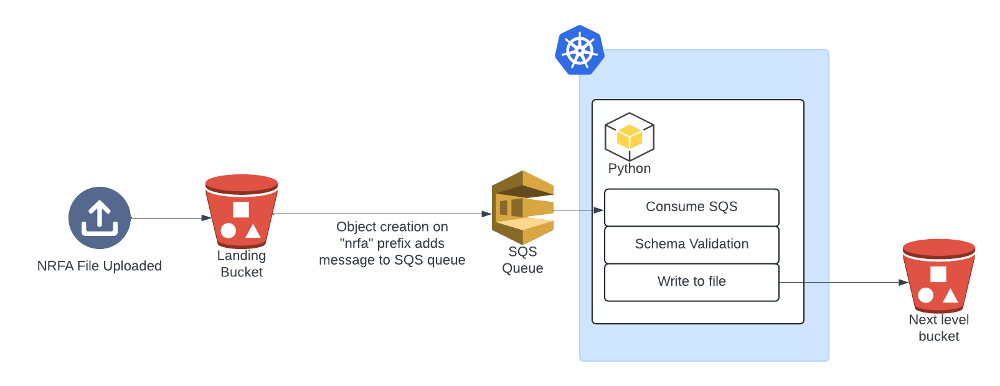

# NRFA Ingestion

## Table of contents
1. [EA Ingester](#ea-ingester)
2. [SEPA Ingester](#sepa-ingester)
3. [NRW Ingester](#nrw-ingester)
4. [NRFA Ingester](#nrfa-ingester)

The NRFA ingester collects the data required to build the [National River Flow Archive](https://nrfa.ceh.ac.uk/) which is the UKs official record of river flow data.

Data comes from four main sources:

- The [EA Hydrology API](https://www.api.gov.uk/ea/hydrology/#hydrology)
- The [SEPA TimeSeries data service](https://timeseriesdoc.sepa.org.uk/)
- The [NRW River level, Rainfall and Sea Data API](https://api-portal.naturalresources.wales/api-details#api=open-data-river-level-rainfall-and-sea-data-api&operation=historicaldataforstationparameter)
- Individual files emailed to UKCEH from the three measuring authorities above.

Each of these sources have their own ingester which loads the data, tries to validate it against the expected format and writes to s3 under a common schema (see below) if successful.

```python
    values: dict = {
        "station_name": pl.String,
        "date": pl.Date,
        "time": pl.Time,
        "timestamp": pl.Datetime,
        "value": pl.Float64,
        "quality_flags": pl.List(pl.String),
        "completeness_flags": pl.List(pl.String),
        "data_flags": pl.List(pl.String),
        "valid": pl.Float32,
        "invalid": pl.Float32,
        "missing": pl.Float32,
        "interpolation": pl.List(pl.String),
        "stage": pl.Float64,
        "source": pl.Float64,
        "comment": pl.List(pl.String),
    }
```

TBC: Data is stored as parquet files under the `nrfa` prefix in the [level 0 bucket](https://eu-west-2.console.aws.amazon.com/s3/buckets/ukceh-fdri-staging-timeseries-level-0?region=eu-west-2&bucketType=general&tab=objects). Data is loaded into batches (define) and partitioned by (define). Alongside data ingested from the files is a json containing some metadata.

Data from the APIs could contain readings from stations which are not part of the NRFA. There is the option to filter for just NRFA stations which are stored (and updated) in the [NRFA network endpoint](https://dri-metadata-api.staging.eds.ceh.ac.uk/id/network/nrfa?_view=extended) from the metadata API.

## EA Ingester

There are two instances of the EA ingester running as argo workflows (managed from the [k8s infra repo](https://github.com/NERC-CEH/dri-infrastructure-k8s-staging/tree/main))

- [ea-daily](https://github.com/NERC-CEH/dri-infrastructure-k8s-staging/blob/main/workloads/argo/workflows/ea/ea-ingester-daily.yaml): Run daily, this instance extracts readings from NRFA stations for the last 7 days.
- [ea-historic](https://github.com/NERC-CEH/dri-infrastructure-k8s-staging/blob/main/workloads/argo/workflows/ea/ea-ingester-historic.yaml): Run monthly, this instance extracts all readings from NRFA stations.

As the EA regularly update readings (mainly from the time lag required to run QA) these two workflows allow us to store a very up-to-date version of the data. New readings simply overwrite old readings.

At the time of writing, just the mean daily flow readings are being ingested.

### The Hydrology API

The API is well [documented](https://environment.data.gov.uk/hydrology/doc/reference) and requires no credentials. It provides access to historic and recent hydrological data including river flows, river levels, groundwater levels, rainfall and water quality at a variety of periods and value types.

The API calls that return readings data have a soft limit of 100,000 rows per-call which can be overridden by setting a `_limit` parameter. However, there is a hard limit of 2,000,000 rows, which cannot be overridden. This is sufficient to return the whole history of a sub-daily time series, or return all values across all stations for two days. To request more data at a time the EA provide a batch api alternative which will queue up larger requests, which will then be processed one at a time.

The base host for the API is https://environment.data.gov.uk/hydrology/id

<[back to table of contents](#table-of-contents)>

## SEPA Ingester

There are two instances of the SEPA ingester running as argo workflows (managed from the [k8s infra repo](https://github.com/NERC-CEH/dri-infrastructure-k8s-staging/tree/main))

- [sepa-daily](https://github.com/NERC-CEH/dri-infrastructure-k8s-staging/blob/main/workloads/argo/workflows/sepa/sepa-ingester-daily.yaml): Run daily, this instance extracts readings from NRFA stations for the last 7 days.
- [sepa-historic](https://github.com/NERC-CEH/dri-infrastructure-k8s-staging/blob/main/workloads/argo/workflows/sepa/sepa-ingester-monthly.yaml): Run daily, this instance extracts all readings from NRFA stations.

Due to a credit limit when using the API (see below) we cannot access all the data for the historic ingester in one go. The ingester is run daily for stations with the oldest 'last accessed' date. This information is stored in a parquet file within the `nrfa` prefix.

At the time of writing, just the mean daily flow readings are being ingested.

### The SEPA Time Series Data Service

The API is well [documented](https://timeseriesdoc.sepa.org.uk/api-documentation/), with lots of [examples](https://timeseriesdoc.sepa.org.uk/api-documentation/api-endpoint-examples/) and a detailed [function reference](https://timeseries.sepa.org.uk/KiWIS/KiWIS?datasource=0&service=kisters&type=queryServices&request=getrequestinfo) listing parameters and possible return fields.

The API operates on a virtual credit based system to manage requests. Virtual credits are based on the number of time series points that a request is predicted to return; for example 1 year of daily data will return 365 values, while 1 day of 15-minute data will return 96 values. Metadata requests use a nominal credit amount (1 or 2 credits) for each type of request. Credits are not split and a minimum of one credit is applied for every request.

Credits are calculated as follows:

- Time series data : 1 credit per 1000 data values
- Last values 1 credit per 20 time series
- Station list, parameter list etc 1 credit per request

Unregistered users, identified by the IP number the request is sent from, are allocated 5000 credits per day. Registered users are allocated more credits per day, but need to use their API access key to authenticate a request.

For further protection of the system a maximum of 300,000 data points are allowed in a single request. Requests where the number of points returned are calculated to exceed this value will be refused (error TooManyResults).

If the standard daily limit is insufficient then you can register for [authorised access](https://timeseriesdoc.sepa.org.uk/api-documentation/register-for-an-api-access-key/).

<[back to table of contents](#table-of-contents)>

## NRW Ingester

TODO

<[back to table of contents](#table-of-contents)>

## NRFA Ingester

The NRFA ingester takes files provided by the measuring authorities above (EA, SEPA and NRW) in CSV, XML or ALL format. The quality and consistency between files varies widely, so the ingester does its best but some files may be rejected.

This ingester is deployed differently to the three above, in that its running all the time waiting for files to be dropped into their respective formats in the [level minus 1 bucket](https://eu-west-2.console.aws.amazon.com/s3/buckets/ukceh-fdri-staging-timeseries-level-m1?region=eu-west-2&bucketType=general&tab=objects) under the `nrfa` prefix. 

Everytime a file is uploaded, a message is sent to the SQS queue which the ingester is polling. This message then gets processed.



Due to the varying consistency of the input files automating this process has proved quite a challenge, and as such there is alot of code around parsing the  files, and validating the information within.

The code tries to ingest as much as possible with lots of functionality within the `models` modules to take into account various formats that may be provided.

<[back to table of contents](#table-of-contents)>