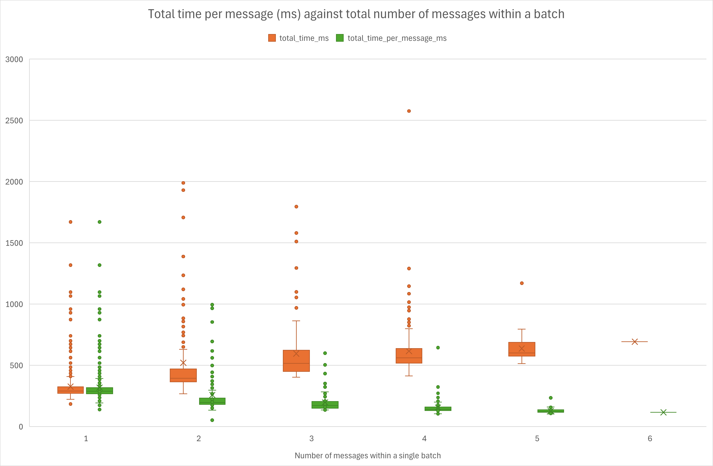

# Performance testing the ingestion app September 2025

Using the logs from the FDRI ingestor running on AWS, various statistics can be inferred as to the performance of message ingestion both for a single message within a batch, and for multiple messages (and therefore multiple sites) within a batch. 

## Table of contents
1. [Method](#method)
2. [Results](#results)
    1. [Batches containing single messages only](#batches-containing-single-messages-only)

## Method
The ingestion of each batch produces a number of log messages, the difference between which can be used to calculate the time each stage took. 

```
time=2025-09-08 09:08:08.686 level=DEBUG thread=139707549842304 loc=ingestion.ingesters.sqs.ingester:109 batch_id=70606a8c-e71c-4fda-a9e8-8478b92a0555 message=Running ingress
time=2025-09-08 09:08:08.878 level=DEBUG thread=139707549842304 loc=ingestion.ingesters.sqs.ingester:172 batch_id=70606a8c-e71c-4fda-a9e8-8478b92a0555 message=Removing duplicates
time=2025-09-08 09:08:08.886 level=INFO thread=139706513209024 loc=ingestion.aws.dynamodb:32 batch_id=70606a8c-e71c-4fda-a9e8-8478b92a0555 message=Items with keys [{'MessageHash': {'S': '0042c7e907b6c9db363edf2605f6e408'}}, {'MessageHash': {'S': '72527982f91f4f42ccce0060d8b4764b'}}, {'MessageHash': {'S': '27d5646e3ebf0f17a3f95562cacb4d94'}}, {'MessageHash': {'S': 'e512bb80ab2727303ba969ee6caa47e1'}}] do not exist.
time=2025-09-08 09:08:08.898 level=DEBUG thread=139707549842304 loc=ingestion.ingesters.sqs.ingester:241 batch_id=70606a8c-e71c-4fda-a9e8-8478b92a0555 message=Validating batch
time=2025-09-08 09:08:08.899 level=DEBUG thread=139707549842304 loc=ingestion.ingesters.sqs.ingester:297 batch_id=70606a8c-e71c-4fda-a9e8-8478b92a0555 message=Writing batch
time=2025-09-08 09:08:09.137 level=INFO thread=139706523698880 loc=ingestion.ingesters.sqs.parquet:153 batch_id=70606a8c-e71c-4fda-a9e8-8478b92a0555 message=Data for 2025-09-08 written to s3://ukceh-fdri-staging-timeseries-level-0/fdri/dataset=one_minute/site=NF55-NQ6X-7HLZ/date=2025-09-08/data.parquet
time=2025-09-08 09:08:09.149 level=INFO thread=139706561984192 loc=ingestion.ingesters.sqs.parquet:153 batch_id=70606a8c-e71c-4fda-a9e8-8478b92a0555 message=Data for 2025-09-08 written to s3://ukceh-fdri-staging-timeseries-level-0/fdri/dataset=one_minute/site=HZEZ-6T2T-5G3Z/date=2025-09-08/data.parquet
time=2025-09-08 09:08:09.166 level=INFO thread=139707010766528 loc=ingestion.ingesters.sqs.parquet:153 batch_id=70606a8c-e71c-4fda-a9e8-8478b92a0555 message=Data for 2025-09-08 written to s3://ukceh-fdri-staging-timeseries-level-0/fdri/dataset=one_minute/site=K3CN-QJ9X-6HQ8/date=2025-09-08/data.parquet
time=2025-09-08 09:08:09.167 level=INFO thread=139706513209024 loc=ingestion.ingesters.sqs.parquet:153 batch_id=70606a8c-e71c-4fda-a9e8-8478b92a0555 message=Data for 2025-09-08 written to s3://ukceh-fdri-staging-timeseries-level-0/fdri/dataset=one_minute/site=CBUW-UPZZ-FK7J/date=2025-09-08/data.parquet
time=2025-09-08 09:08:09.179 level=DEBUG thread=139707549842304 loc=ingestion.ingesters.sqs.ingester:334 batch_id=70606a8c-e71c-4fda-a9e8-8478b92a0555 message=Finished processing batch

```

By piping the log output to file, the following script could be used to parse the logs, extract the timings between steps, the number of sites each batch has written out to, and produce a number of summary csv files. These can then be imported into Excel or similar for further analysis if necessary

<details>
<summary>Script used for parsing the log file</summary>

```python
from collections import defaultdict
from datetime import datetime

import polars as pl

log_path = "/home/samantha/temp/performance_testing/fdri_ingestion_copy.log"
output_path = "/home/samantha/temp/performance_testing/processed.csv"
summary_output_path = "/home/samantha/temp/performance_testing/processed_summary.csv"
filtered_summary_output_path = (
    "/home/samantha/temp/performance_testing/processed_filtered_summary.csv"
)

MESSAGE_MAP = {
    "Running ingress": "INGRESS",
    "Removing duplicates": "DUPLICATES",
    "Validating batch": "VALIDATING",
    "Writing batch": "WRITING",
    "Finished processing batch": "FINISHED",
}


def main():
    with open(log_path) as log_file:
        data = log_file.readlines()

    log_messages = parse_log_messages(data)


    # Convert the per-batch dictionary to a polars dataframe to make analysis easier. Drop any rows with NaN or null
    # values as these will have come from a partially logged batch (e.g. at the beginning or the end of the log file).
    df = pl.DataFrame(
        [{"batch_id": key} | value for key, value in log_messages.items()]
    )
    df = df.drop_nans()
    df = df.drop_nulls()

    # Create the analysed df containing the total time taken per message and for each stage within a batch on a
    # per-batch basis.
    analysed_df = analyse_df(df)
    analysed_df.write_csv(output_path)

    # Write two summaries to file. The first takes into consideration all batches, regardless of how many messages
    # they may have contained, and the second considers only batches with a single message and site, to make calculating
    # projected processing times easier (e.g. for a weeks worth of messages for a single site).
    summary_df = summarise_df(analysed_df)
    summary_df.write_csv(summary_output_path)

    # Filter to only those batches which contain a single site and message
    filtered_summary_df = summarise_df(
        analysed_df.filter(analysed_df["num_items"] == 1)
    )
    filtered_summary_df.write_csv(filtered_summary_output_path)

    # Calculate the projected times for various permutations
    for num_items in analysed_df["num_items"].unique():
        projected_df = calculate_projected_times(
            summarise_df(analysed_df.filter(analysed_df["num_items"] == num_items))
        )
        print(f"Projected df for num_items: {num_items}")
        print(projected_df)

    print("Finished")

def parse_log_messages(data):
    """
    Analyse each row from the log file, extracting the batch id, the time and it's source stage (e.g. ingress), the
    site ID of any data written to parquet and how many messages have been identified as not yet processed during
    the ingress stage.
    """
    log_messages = {}
    for row in data:
        if "batch_id=" not in row:
            continue
        row_items = row.split(" ")

        time = " ".join(row_items[:2]).replace("time=", "")
        time = datetime.strptime(time, "%Y-%m-%d %H:%M:%S.%f")

        batch_id = row_items[5].replace("batch_id=", "")

        log_messages.setdefault(batch_id, defaultdict(None))
        message = " ".join(row_items[6:]).replace("message=", "")
        for key, code in MESSAGE_MAP.items():
            if key in message:
                log_messages[batch_id][code] = time
        if "Items with keys" in message:
            num_items_in_batch = len(
                message.replace("Items with keys [", "")
                .replace("] do not exist.\n", "")
                .split(",")
            )
            log_messages[batch_id]["num_items"] = num_items_in_batch

        if "written to s3" in message:
            site_id = [item for item in message.split("/") if "site=" in item][0].split(
                "="
            )[1]
            log_messages[batch_id].setdefault("sites", [])
            log_messages[batch_id]["sites"].append(site_id)

    return log_messages

def analyse_df(df):
    # Expressions to calculate the number of unique sites per batch, and the total number of milliseconds taken
    # including the overall time per batch, the overall time per message and the duration of each processing stage.
    expressions = [
        pl.col("sites").list.unique().list.len().alias("num_sites"),
        (
            ((pl.col("FINISHED") - pl.col("INGRESS")).dt.total_milliseconds())
            / pl.col("num_items")
        ).alias("total_time_per_message_ms"),
        (pl.col("FINISHED") - pl.col("INGRESS"))
        .dt.total_milliseconds()
        .alias("total_time_ms"),
        (pl.col("DUPLICATES") - pl.col("INGRESS"))
        .dt.total_milliseconds()
        .alias("ingress_time_ms"),
        (pl.col("VALIDATING") - pl.col("DUPLICATES"))
        .dt.total_milliseconds()
        .alias("dedup_time_ms"),
        (pl.col("WRITING") - pl.col("VALIDATING"))
        .dt.total_milliseconds()
        .alias("validation_time_ms"),
        (pl.col("FINISHED") - pl.col("WRITING"))
        .dt.total_milliseconds()
        .alias("writing_time_ms"),
    ]

    analysed_df = df.with_columns(*expressions).drop("sites")
    return analysed_df

def summarise_df(df):
    summary_cols = [
        "total_time_per_message_ms",
        "total_time_ms",
        "ingress_time_ms",
        "dedup_time_ms",
        "validation_time_ms",
        "writing_time_ms",
    ]
    summary_df = df[summary_cols].describe()
    return summary_df


def calculate_projected_times(df):
    total_mean_time_per_message = df.filter(df["statistic"] == "mean")[
        "total_time_per_message_ms"
    ][0]

    data = [
        {
            "label": "1 message",
            "num_messages": 1,
            "total_time": total_mean_time_per_message,
        },
        {
            "label": "1 day",
            "num_messages": 1440,
            "total_time": total_mean_time_per_message * 1440,
        },
        {
            "label": "1 week",
            "num_messages": 10080,
            "total_time": total_mean_time_per_message * 10080,
        },
        {
            "label": "1 month (31 days)",
            "num_messages": 44640,
            "total_time": total_mean_time_per_message * 44640,
        },
    ]

    projected_df = pl.DataFrame(data)
    projected_df = projected_df.with_columns(
        pl.from_epoch("total_time", time_unit="ms").dt.time().alias("total_time")
    )
    return projected_df


if __name__ == "__main__":
    main()

```
</details>

## Results

### Batches containing single messages only
For a single message per batch, over 546 batches, the mean time taken per batch was 323ms. Extrapolating this out to
estimate the time required for 1 day, 1 week and 1 month (31 days) worth of messages for a single site produces the 
following numbers:

|           | Num messages | total_time   |
|-----------|--------------|--------------|
| 1 message	| 1            | 00:00:00.323 |
| 1 day     | 1440         | 00:07:45.684 |
| 1 week    | 10080        | 00:54:19.790 |
| 1 month   | 44640        | 04:00:36.216 |

When looking at the proportion of time taken by each stage within a batch, it is clear that writing is the most time consuming (~57%), followed by the initial ingress stage (~37%). Validation (shown in yellow in the chart below) is negligible (~0.4%), and whilst deduplication takes longer than validation, it also only contributes a minor amount to the total processing time per batch (~6%).


### Batches containing multiple messages

Looking at the same set of log messages, but without excluding multiple-message batches allows any economies of scale to become visible. The chart below shows both the total time per batch and the calculated total time per message within a batch, and clearly shows that whilst the total time per batch increases with more messages, on a per-message basis, each message is processed faster within the batch. 



Looking at the individual stages within a batch, there are no clear trends visible in any changes to the proportion of time taken per stage in relation to the batch size. Ingress does appear to take slightly longer where a batch contains more than one message, and writing possibly a slightly shorter proportion of time, but these differences are relatively negligible. 


The table below shows the projected runtimes for various number of messages for a single site against the number of 
messages within a batch. It is interesting to see how the projected runtimes reduce with the increasing number of messages within a batch. However it should be noted that in general, the source data for multiple messages within a batch comes from each batch processing multiple sites (e.g. 5 messages in a batch is a message for each of 5 sites). As such, these projected figures can only be considered a rough indication of performance for a single site with multiple messages.

|   | 1 message    | 1 day        | 1 week       | 1 month      |
|---|--------------|--------------|--------------|--------------|
| 1 | 00:00:00.323 | 00:07:45.684 | 00:54:19.790 | 04:00:36.216 |
| 2	| 00:00:00.253 | 00:06:04.345 | 00:42:30.416 | 03:08:14.703 |
| 3 | 00:00:00.193 | 00:04:39.016 | 00:32:33.112 | 02:24:09.496 |
| 4 | 00:00:00.153 | 00:03:41.469 | 00:25:50.283 | 01:54:25.540 |
| 5	| 00:00:00.128 | 00:03:05.056 | 00:21:35.392 | 01:35:36.736 |
