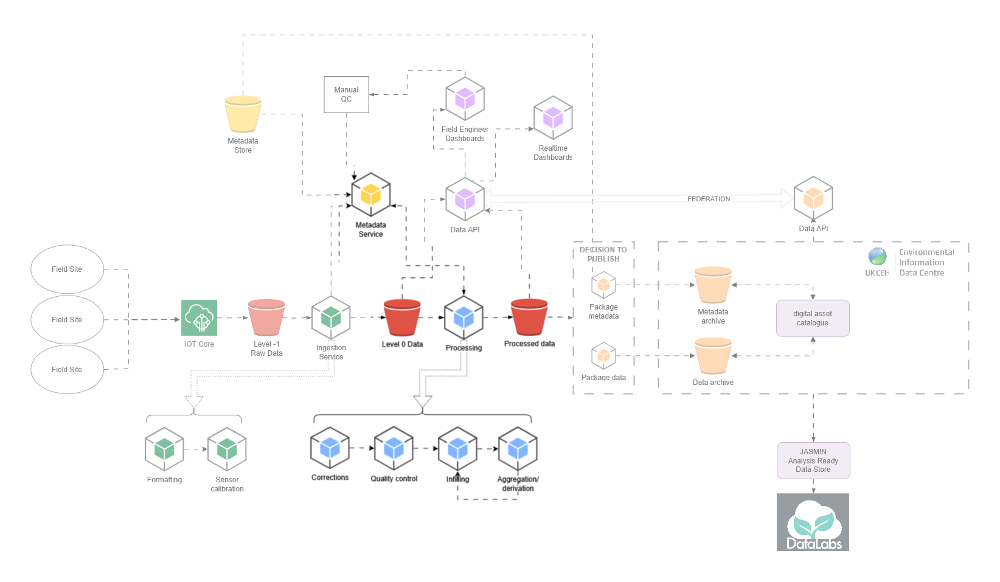

# Timeseries Processor
The timeseries processor application is part of the FDRI architecture and handles all the processing between **level 0** and **processed**.



This documentation will provide a higher level overview of the application. For guidance on how to run the application, and how to contribute, see the repository [README](https://github.com/NERC-CEH/dri-timeseries-processor).

## Table of contents
1. [Introduction](#introduction)
2. [Components](#components)
    1. [Inputs](#inputs)
    2. [Building timeseries IDs to process](#building-timeseries-ids-to-process)
    3. [Flags](#flags)
    4. [Corrections](#corrections)
    5. [Quality control](#quality-control)
    6. [Infilling](#infilling)
    7. [Aggregation and Derivation](#aggregation-and-derivation)
    8. [Outputs](#outputs)
3. [Glossary](#glossray)


## Introduction
The timeseries processor handles the processing and checking of timeseries data within the FDRI project and is powered by configurations available through the [metadata store](https://dri-metadata-api.staging.eds.ceh.ac.uk/doc/reference). It takes level 0 data, which has been ingested through the [ingester application](https://github.com/NERC-CEH/dri-ingestion), processes the data based on the configurations, and exports the data into a database.

The tool is a python application which takes a set of arguments (see [Inputs](#inputs)). The processor runs automatically at X every day via a workflow orchestration tool called Argo Workflows which is hosted in the FDRI kubernetes cluster. This is managed in the [kubernetes infrastructure repository](https://github.com/NERC-CEH/dri-infrastructure-k8s-staging). The application can also be run as a one-off job as and when required.

<[back to table of contents](#table-of-contents)>

## Components
The application can be split into several components, each of which will be discussed briefly below.

Insert flowchart

<[back to table of contents](#table-of-contents)>

### Inputs

---

The application takes a variety of user inputs entered as command-line arguments. These arguments define the date range and the timeseries IDs to be processed.

> period (**required**):\
The period of time to process
- Must be a valid [ISO8601 duration](https://docs.digi.com/resources/documentation/digidocs/90001488-13/reference/r_iso_8601_duration_format.htm)
- Must not have a time component
- Can be a combination of days, weeks, months and years

> --end_date (**optional**)\
The start date for processing
- Must be of the format YYYY-MM-DD
- If not provided then todays date is used

> --sites (**optional**)\
The site(s) to process
- If empty then all sites will be built
- Entered sites are checked against available sites in the metadata store and removed if not found
- sites must be seperated by a comma, be 5 characters long and not contain special characters
- sites can be lower or upper case

> --columns (**optional**)\
The column(s) to process
- If empty then all columns will be built
- Columns must be seperated by a comma (no spaces)
- Columns can be upper or lower case

> --periodicity (**optional**)\
The period(s) to process
- Must be a valid [ISO8601 duration](https://docs.digi.com/resources/documentation/digidocs/90001488-13/reference/r_iso_8601_duration_format.htm)
- Multiple periodicities must be seperated by a comma
- Can be upper or lower case

Some examples:

Get the last two days data for all sites, columns and periodicities

```
python -m dritimeseriesprocessor P2D
```

Get the last two days data from 2024-03-05 for all sites, columns and periodicities

```
python -m dritimeseriesprocessor P2D --end_date=2024-03-05
```

Get the last months data from 2024-03-05 for ALCI and BUNNY sites and all columns and periodicities

```
python -m dritimeseriesprocessor P1M --end_date=2024-03-05 --sites=alic1,bunny
```

Get the last two days data from 2024-03-05 for ALCI and BUNNY sites, variables TA and PA and all periodicities

```
python -m dritimeseriesprocessor P2D --end_date=2024-03-05 --sites=alic1,bunny --columns=TA,PA
```

Get the last two days data from 2024-03-05 for ALCI and BUNNY sites, variables TA and PA and a periodicity of 30 mins

```
python -m dritimeseriesprocessor P2D --end_date=2024-03-05 --sites=alic1,bunny --columns=TA,PA --periodicity=PT30M
```

<[back to table of contents](#table-of-contents)>

### Building Timeseries IDs to process

---

The processor uses the arguments above to build a set of timeseries IDs to process, and collects any metadata that is required to complete the processing.

The first stage is to collect the timeseries IDs based on the arguments. These are generated by sending the arguments to the [datasets](https://dri-metadata-api.staging.eds.ceh.ac.uk/id/dataset?_limit=10) endpoint in the metadata store. This gives a dictionary of timeseries IDs along with some metadata.

Each timeseries ID might have some other timeseries IDs that it is dependent on to be processed. There are two types of dependency:

**Processing dependencies**:
Each timeseries ID might have certain processing dependencies. These are generated by calling the [data processing configuration](https://dri-metadata-api.staging.eds.ceh.ac.uk/id/data-processing-configuration?_limit=10) endpoint in the metadata store.

**Derivation dependencies**:
Each timeseries ID might be dependant on other timeseries IDs (for example, a `processed` timeseries will require the associated `raw` timeseries). These dependencies are stored with the timeseries definition, rather than the timeseries ID (see [glossary](#glossary)) and are generated by calling the [timeseries definition](https://dri-metadata-api.staging.eds.ceh.ac.uk/ref/time-series-definition?_limit=10) endpoint in the metadata store.

Finally, some additional metadata (`method_type` and `inputs`) are added from the timeseries definition response and a `load` parameter is calculated indicated whether the data needs to be loaded (i.e. `raw` timeseries required for `processed` timeseries).

Below is an example output of these processes when the processing is run with the following arguments.

```
python -m dritimeseriesprocessor P2D --sites=eastb --columns=WD --periodicity=PT30M
```

```
{
    # Timeseries ID built from the arguments
    "http://fdri.ceh.ac.uk/id/dataset/cosmos-eastb-wd_30min_processed":
    {
        "ts_def": "http://fdri.ceh.ac.uk/ref/cosmos/time-series/wd_30min_processed",
        "resolution": "PT30M",
        "periodicity": "PT30M",
        "processing_level": "processed",
        "sourceBucket": "ukceh-fdri-staging-timeseries-qc",
        "sourceDataset": "PROCESSED_DATA_30MIN",
        "sourceColumnName": "WD",
        "sourceSite": "EASTB",
        "method_type": "process",
        "inputs":
        [
            "http://fdri.ceh.ac.uk/ref/cosmos/time-series/wd_30min_raw"
        ],
        "load": False
    },
    # Dependent timeseries ID
    "http://fdri.ceh.ac.uk/id/dataset/cosmos-eastb-scans_30min_raw":
    {
        "ts_def": "http://fdri.ceh.ac.uk/ref/cosmos/time-series/scans_30min_raw",
        "resolution": "PT30M",
        "periodicity": "PT30M",
        "processing_level": "raw",
        "sourceBucket": "ukceh-fdri-staging-timeseries-level-0",
        "sourceDataset": "LIVE_SOILMET_30MIN",
        "sourceColumnName": "SCANS",
        "sourceSite": "EASTB",
        "inputs":
        [],
        "load": True
    },
    # Dependent timeseries ID
    "http://fdri.ceh.ac.uk/id/dataset/cosmos-eastb-battv_30min_raw":
    {
        "ts_def": "http://fdri.ceh.ac.uk/ref/cosmos/time-series/battv_30min_raw",
        "resolution": "PT30M",
        "periodicity": "PT30M",
        "processing_level": "raw",
        "sourceBucket": "ukceh-fdri-staging-timeseries-level-0",
        "sourceDataset": "LIVE_SOILMET_30MIN",
        "sourceColumnName": "BATTV",
        "sourceSite": "EASTB",
        "inputs":
        [],
        "load": True
    },
    # Dependent timeseries ID
    "http://fdri.ceh.ac.uk/id/dataset/cosmos-eastb-wd_30min_raw":
    {
        "ts_def": "http://fdri.ceh.ac.uk/ref/cosmos/time-series/wd_30min_raw",
        "resolution": "PT30M",
        "periodicity": "PT30M",
        "processing_level": "raw",
        "sourceBucket": "ukceh-fdri-staging-timeseries-level-0",
        "sourceDataset": "LIVE_SOILMET_30MIN",
        "sourceColumnName": "WD",
        "sourceSite": "EASTB",
        "inputs":
        [],
        "load": False
    }
}
```

All the metadata required to process the requested timeseries IDs has now been collected. Data for each timeseries ID is loaded into a [Timestream](https://nerc-ceh.github.io/time-stream/) object before being passed into the processing stages.

<[back to table of contents](#table-of-contents)>

### Flags ###

---

A flagging system is used to keep track of what tests have been undertaken as part of the processing. Each column will have a set of core tests that are checked and then additional flags are added to the timestream object based on what component of the processing they relate to. For example, the timeseries for `SWOUT` has core tests and ones for all the components.

```
┌─────────────────────────┬───────┬─────────────────┬───────────────┬───────────────┬───────────────────┐
│ time                    ┆ SWOUT ┆ SWOUT_CORE_FLAG ┆ SWOUT_PR_FLAG ┆ SWOUT_QC_FLAG ┆ SWOUT_INFILL_FLAG │
│ ---                     ┆ ---   ┆ ---             ┆ ---           ┆ ---           ┆ ---               │
│ datetime[μs, UTC]       ┆ f64   ┆ i64             ┆ i64           ┆ i64           ┆ i64               │
╞═════════════════════════╪═══════╪═════════════════╪═══════════════╪═══════════════╪═══════════════════╡
│ 2024-03-08 00:00:00 UTC ┆ 1.265 ┆ 0               ┆ 0             ┆ 0             ┆ 0                 │
```

Configurations for the tests that can be run on the timeseries are currently stored within the repository, but these will likely be moved to the metadata store. Each test contains an `id` which is a multiple of two (representing a "bit" in a binary number) and is used as part of a bitwise flagging system.

```
        "corrected": {
            "name": "Corrected",
            "description": "Data point has been adjusted from original value.",
            "symbol": "C",
            "id": 1
        },
        "estimated": {
            "name": "Estimated",
            "description": "Data point is an estimate in some way, either through infilling techniques or incomplete derivation.",
            "symbol": "E",
            "id": 2
        },
        "missing": {
            "name": "Missing",
            "description": "Data point was not recorded.",
            "symbol": "M",
            "id": 4
        },
        "removed": {
            "name": "Removed",
            "description": "Data point was removed by QC.",
            "symbol": "R",
            "id": 8
        },
        "suspicious": {
            "name": "Suspicious",
            "description": "Data point is potentially erroneous or requiring further investigation.",
            "symbol": "S",
            "id": 16
        },
        "unchecked": {
            "name": "Unchecked",
            "description": "Data point has not been verified by QC.",
            "symbol": "U",
            "id": 32
        }
```

If the data point fails a test, then the `id` is added to the flag column. This results in a integer which is a unique identifier for which tests have failed.

```
┌─────────────────────────┬───────┬─────────────────┬───────────────┬───────────────┬───────────────────┐
│ time                    ┆ SWOUT ┆ SWOUT_CORE_FLAG ┆ SWOUT_PR_FLAG ┆ SWOUT_QC_FLAG ┆ SWOUT_INFILL_FLAG │
│ ---                     ┆ ---   ┆ ---             ┆ ---           ┆ ---           ┆ ---               │
│ datetime[μs, UTC]       ┆ f64   ┆ i64             ┆ i64           ┆ i64           ┆ i64               │
╞═════════════════════════╪═══════╪═════════════════╪═══════════════╪═══════════════╪═══════════════════╡
│ 2024-03-08 00:00:00 UTC ┆ 1.265 ┆ 50               ┆ 7             ┆ 10             ┆ 0                 │
```
For example, SWOUT failed the `estimated`, `suspicious` and `unchecked` core tests, and didnt fail any infilling tests.


### Corrections

---

Sample text here

<[back to table of contents](#table-of-contents)>

### Quality Control

---

Sample text here

<[back to table of contents](#table-of-contents)>

### Infilling

---

Sample text here

<[back to table of contents](#table-of-contents)>

### Aggregation and Derivation

---

Sample text here

<[back to table of contents](#table-of-contents)>

### Outputs

---

<[back to table of contents](#table-of-contents)>


## Glossary

---

**Level minus 1**: Level minus 1 data is the raw data directly from the sensor.

**Level 0**: Level 0 data is the raw data (level minus 1) from the sensor that has been validated against an expected schema and saved to parquet files.

**Timeseries definition**: A timeseries defined by a network, column, processing level and period e.g. `http://fdri.ceh.ac.uk/ref/cosmos/time-series/precip_30min_raw`

**Timeseries ID**: A timeseries definition for a particular site e.g. `cosmos-chobh-precip_30min_raw`. A timeseries definition will contain several timeseries IDs.

<[back to table of contents](#table-of-contents)>