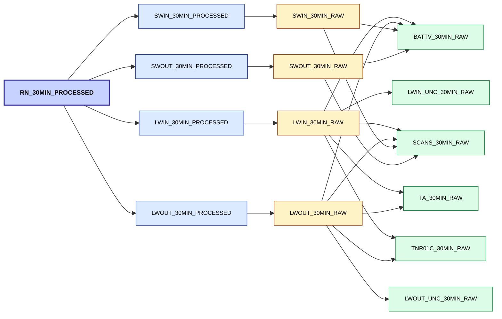

# 2025 Week 48 DRAFT

It's back!! This time it's a shared effort from the entire FDRI WP2 development team! Many things have happened in the past few weeks, too much to cover, here's a couple of things

## 🤘 FDRI Site Name Metadata in the UI 

Real Site names are now presented in the UI, this is a huge milestone in us getting to a place where the data and metadata are in place, in sync and can be read and loaded into the UI.

## ⏳ Batch uploader live for NRFA data

The uploader page allows users to create batches ready for the NRFA. Files are checked to ensure no obvious security risks are contained, before being sent to the ingester. If they run through the ingester then the data is ready to view in the UI. If not, the error message is sent back to user for further investigation. This links up several components we have been working on. Next up - metadata!

## 🗡️ Processing DAG Work

We've reworked how our time series processor resolves dependencies using a Directed Acyclic Graph (DAG), lots of fun stuff in the write up here: 
[https://github.com/NERC-CEH/fdri_words/blob/main/adrs/011-Metadata-Drive-DAG-Processor.md](https://github.com/NERC-CEH/fdri_words/blob/main/adrs/011-Metadata-Drive-DAG-Processor.md)

## 🪨 Geospatial Update

We've been experimenting with using Titiler to serve COG formatted rasters stored on S3 and now have a prototype API and UI up and running so we can start testing performance. 

The UI can be viewed here: [https://dri-ui.staging.eds.ceh.ac.uk/fdri-spatial](https://dri-ui.staging.eds.ceh.ac.uk/fdri-spatial) and the API documentation here: [https://dri-geospatial-api.staging.eds.ceh.ac.uk/api/docs
](https://dri-geospatial-api.staging.eds.ceh.ac.uk/api/docs
)

## 🏬 Repartitioning our data

We went through the fun task of restructuring our level zero data, so we are no longer storing against the campbell cloud id and include an extra level of granulaty of serial_no, for when we have multiple loggers sending data from a site.
This was required to start support metadata in the api/ui, see point 1 at the top. We were able to do this without breaking anything, we stopped the ingester, moved around the data, switched it back on with the code changes. It's nice how we can still do these repartitioning tasks without major downtime and without loosing data.

## ✅ FDRI timeseries metadata

Currently the metadata for FDRI data (variable name, colunm name, units etc.) is read from the data files or hard coded. The first set of properly curated metadata has been added to the metadata store, linking it in to the bountiful ecosyetem of shared parameter/varible names and units! Work will continue to build up metadata in there and hook up our ingestors, UI and processing.
