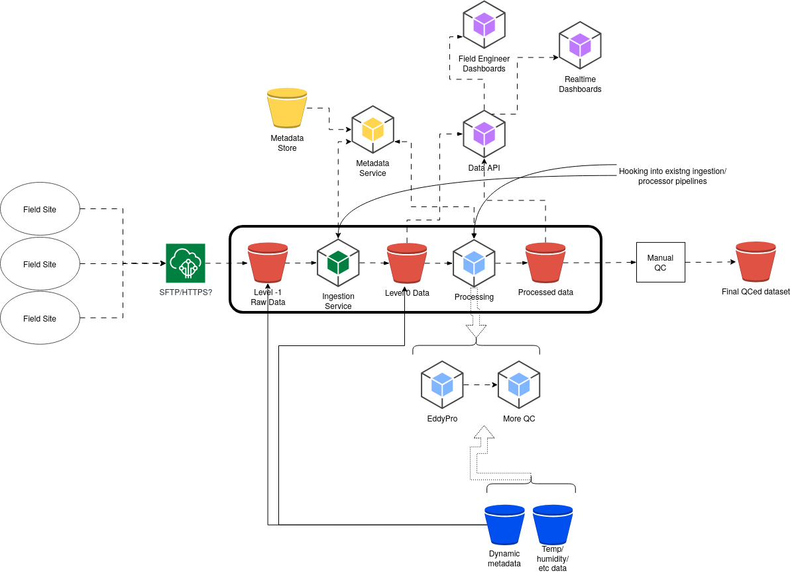

# 2026 Week 3 DRAFT

First week note of 2026!

## New IOT Domain for FDRI

## Cosmos MQTT coming soon

## AWS ADR

## Flux data

This week we've kicked off the flux/eddy covariance work.  The aim is to take 20 Hz data measuring water vapour fluxes, telemeter them back into an S3 bucket, then run processing software (EddyPro) on it to produce 30-minute output.  We're hoping to reuse as much as possible of the [ingestion](https://github.com/NERC-CEH/dri-ingestion) and [processing](https://github.com/NERC-CEH/dri-timeseries-processor) code.  There are a few additional challenges with some of the metadata and data that the processing software needs to run, as well as dealing with the sheer volume of 20 Hz data from lots of sites (although only 1 is running so far).

This is a diagram of how the architecture plan looks at the moment:

So far, we've got the team (Hamayoon, Josh, Matt C, Matt DP, Ola, Robin with Hollie as Product Owner) together and up to speed on what we are doing, and set up some initial investigatory tickets.  Some important early jobs are:

- speak to other groups doing eddy covariance analysis with the hope that we can build something that can fit into their workflows too
- decide how we want to arrange our buckets: whether we share the existing time series ones or set up our own
- work out the best way of integrating EddyPro (which is usually used with a GUI) into a headless pipeline
