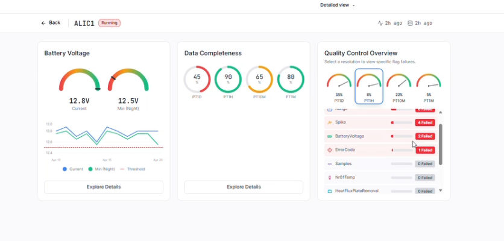

# 2026 Week 10 DRAFT

Working with the September launch in mind, compelling user experiences

## Welcome Ludwig Trotter!

## Gridded timeseries data

Workshop with advisory group - platforms, programming languages, learning material and of course data!

[FDRI Gridded Notebooks](https://github.com/NERC-CEH/fdri-gridded-notebooks/)

## Metadata

Simon gave a really helpful overview for newer members of the dev team, insight into the inner workings of the metadata service that provides FDRI's "source of truth".

Detail of calibration coefficients, managing vocabulary, coordinating with WP1 to keep it updated

Vocabulary development

## Timeseries data explorer

Quality Controlled and processed data from FDRI sites making its way into the platform, following the patterns set by COSMOS

Round of work on improving the user experience of exploring data, filtering for what they're interested in. Using Figma Make to do rapid prototyping of interfaces to get quick feedback.

## Network monitoring

Figma prototyping also useful to produce a custom dashboard to support the field engineering team, make a network observable.

Find upcoming issues sooner and surface the QC information to help keep the network healthy and quickly diagnose the sources of problems

## Flux

Interactions with the metadata service for new kinds of stations

Work on the telemetry with WP1 - solution for data which is too high volume to send via MQTT, which is best suited to small chunks of data related to measurements.

## Ingesters

Nathan and Leanne have updating the EA ingester to ingester 15min flow and rainfall data.

## AWS Migration

We have live FDRI data streaming into the new production account [https://dri-ui.dri.ceh.ac.uk/fdri/sites/SE-CARWE-01](https://dri-ui.dri.ceh.ac.uk/fdri/sites/SE-CARWE-01). This makes visible a huge effort to migrate into our new AWS accounts.

Next steps:
- COSMOS: awaiting IT to create a system user
- Phenocam: awaiting IT to create a system user
- Migrating iot devices: in progress
- Delete everything from old staging account: await the above

## Data management - exciting update!

Getting a backlog fleshed out of data publication features for the dev team to work on

## Citizen science gauging data

_Sounds very interesting, ask Hollie for context_

## Upcoming events

Members of the project are welcome to submit abstracts to the NERC Digital Gathering, the CFP closes on 25th May
