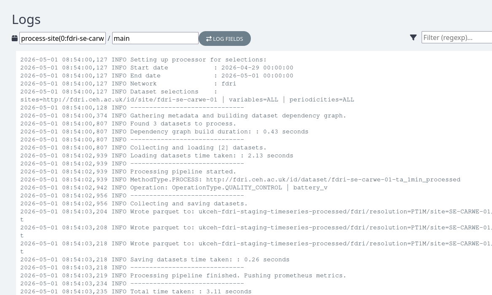
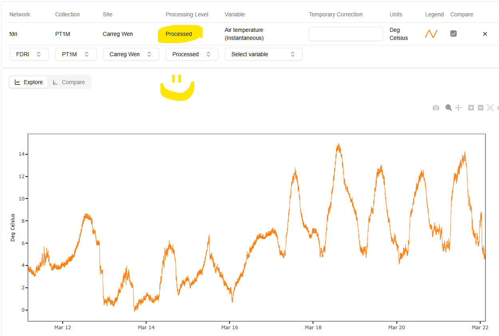
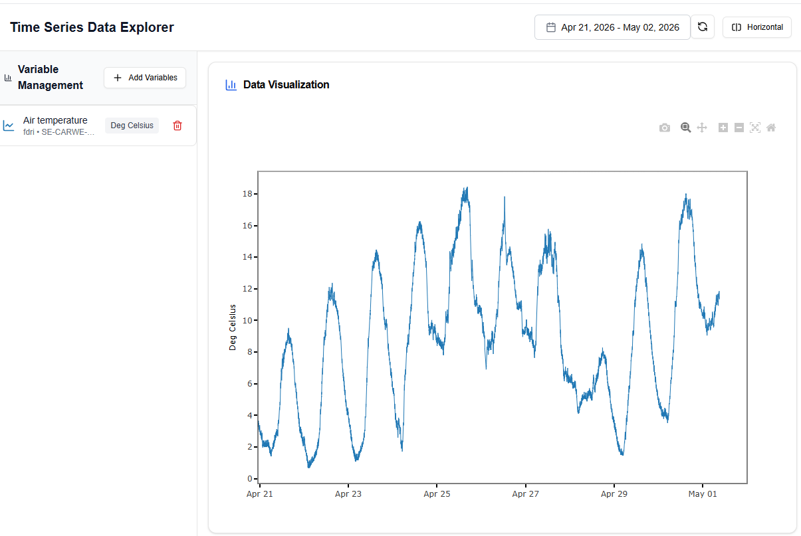
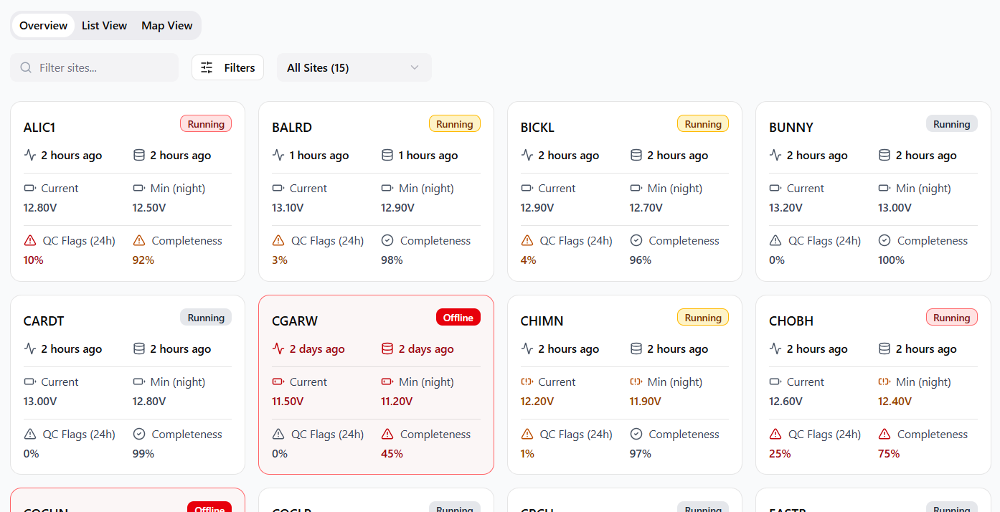
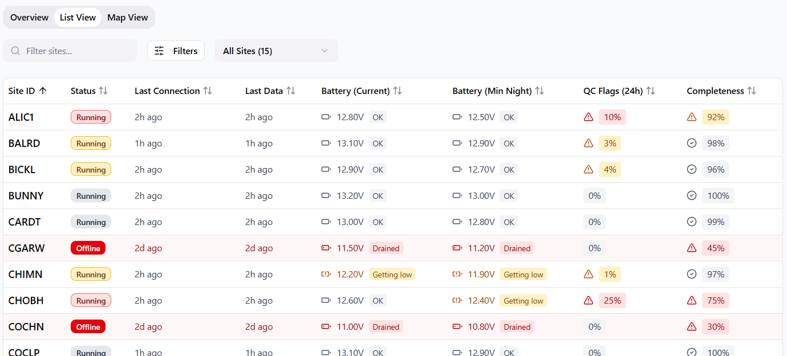
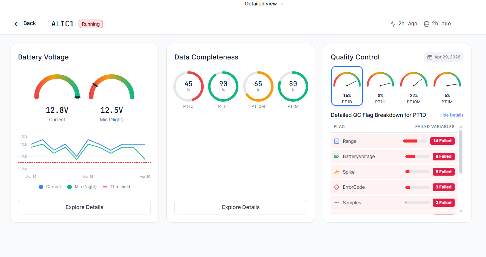
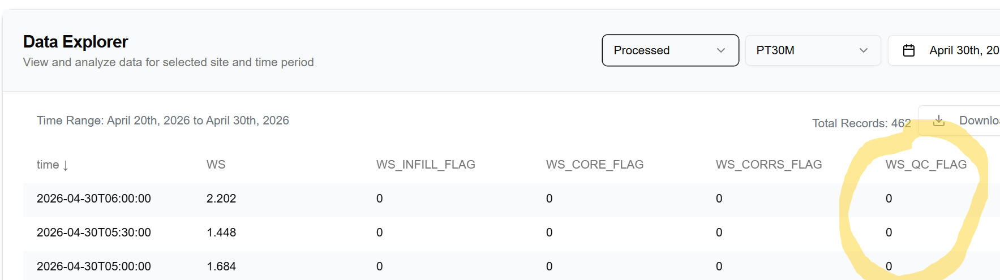

# 2026 Week 18 - picking up pace

As we hold the September launch of the FDRI platform increasingly in mind, we're working to create compelling user experiences for researchers and field teams. We're seeing the first quality-controlled and processed data flow through our systems for FDRI sites, and building towards data publication via the [Environmental Information Data Centre](https://eidc.ac.uk/) 

## Welcome Ludwig Trotter!
We have a new member! Ludwig joined UKCEH as a Senior Cloud Engineer in the Digital Research Group last week and is looking forward to working with the team on FDRI. He recently completed his PhD in Computer Science at Lancaster University, where he worked as a Senior Research Assistant in the Pervasive Computing Group. Ludwig’s background is distinctly cross-disciplinary, spanning electronic engineering, computer science, human–computer interaction, and pervasive computing. Welcome!

## Gridded timeseries data

The Gridded data team ran a workshop with its advisory group - learning about and reacting in response to their needs for platforms, programming languages, learning material and of course data!

[FDRI Gridded Notebooks](https://github.com/NERC-CEH/fdri-gridded-notebooks/) - this open source repository of gridded data notebooks accompanied the workshop.

## Metadata

Simon gave a really helpful overview for newer members of the dev team, insight into the inner workings of the metadata service that provides FDRI's "source of truth". There's a lot of detail potential available for calibration coefficients, managing vocabulary. A key resource which needs ongoing coordination with WP1 to ensure it reflects what's in the field fully enough to power our data services.

## Timeseries processing pipeline

A proof-of-concept processing pipeline has been set up for FDRI site data (Carreg-Wen, Air Temperature). This runs a simple "battery voltage" QC check on the air temperature time series and saves the data out into our "processed" S3 bucket. This can then be picked up by the data API and ultimately shown on the UI. 

Next step is to bulk out the data processing configuration metadata so we apply a full suite of QC checks, infilling procedures, data corrections, to all of the variables from the deployed FDRI sites.

## Timeseries data explorer

Following the processing pipeline update (above) processed data from FDRI sites is making its way into the platform, following the patterns set by COSMOS:

And a new round of work on improving the user experience of exploring data and quickly filtering it to show what they're interested in. Team members have been using Figma Make, an AI-assisted design tool, to do rapid prototyping of interfaces to get quick feedback, and sharing that experience with the wider group.

## Network Monitoring

We have created Figma mockups and some working code to allow field engineers to get a quick overview of the status of sites on a network, and to drill into each site's details to see what's going on.  As shown at various meetings, the network overview mockups display summary information about sites in card and table views, like this:

| Card view |
| :---: |
|  |

| List view |
| :---: |
|  |

We've already published the backend API endpoint to provide the initial data needed by these user interfaces (UI).  It has enough information to populate the Offline/Online status, last connection and last data received that you see in those mockups.  The initial implementation didn't run fast enough, so we've improved it and updated the UI so you see sites appear as their data arrives.  That UI code is now written and under review.  Running on my slightly slow developer environment it looks like this (hopefully to be released soon after you've read this):

https://github.com/user-attachments/assets/683c1bfd-db81-492e-9a46-1bf1e318f019

We've also been designing the more detailed site information tab to help a field engineer understand the issues at a site.  It has information about battery voltage, completeness and quality control (QC) of data.  The QC will show issues like range/threshold exceedence, spike/gap/flatline detection, etc.  Here's the start of the site status detail page, these summary panels will interactively display more detailed breakdowns in the space beneath them:

The processing of the raw timeseries data (which produces the QC flags) has been running for sometime for COSMOS - but hot-off-the-press today is that FDRI data processing is now running.  Currently, you can see raw QC bitmask values in the Data Explorer page of the UI (columns suffixed with _QC_FLAG), but these aren't useful until they are decoded - our job is to turn them into a service that powers the QC visualizations.  In the example below they are all zeros, so nothing failing there:

## Flux

Updated diagram as of 17 April:

We're currently working on building out the processing config and dataset definitions in the metadata service to get stuff processed, as well as making sure that all the post-EddyPro processing can be done.

There's also been a lot of discussion between the Flux and Timeseries teams about the best way to integrate any future 3rd-party packages analogously to EddyPro, and we've eventually decided that the current architecture of the timeseries processor is flexible enough to cross that bridge when we come to it and that there's enough work to be done now without speculatively trying to solve problems we don't have yet.

Interactions with the metadata service for new kinds of stations. There's also ongoing work on the telemetry with WP1 and IT Infrastructure - creating a VPN solution for downloading data directly from field sites, when it's too high volume to send via MQTT, which is best suited to small chunks of data related to measurements. There's already interest from other teams in using this setup - thank you to Joe Carpenter for all the effort getting it in place.

## Ingesters

Nathan and Leanne have updating the EA ingester to ingester 15min flow and rainfall data./

## AWS Migration

We have live FDRI data streaming into the new production account [https://dri-ui.dri.ceh.ac.uk/fdri/sites/SE-CARWE-01](https://dri-ui.dri.ceh.ac.uk/fdri/sites/SE-CARWE-01). This makes visible a huge effort to migrate into our new AWS accounts.

We've just kicked off migrating the historical data from our old staging account to our production account, above is the queue receiving the data and it being ingested. Hope to come back to an empty queue after the weekend!

Next steps:

- COSMOS: awaiting IT to create a system user
- Phenocam: awaiting IT to create a system user
- Migrating iot devices: in progress
- Delete everything from old staging account: await the above

## Data management - exciting update!

We fleshed out the backlog with data publication features for the dev team to work on. The first development they will focus on is creating a form in the EIDC catalogue to capture metadata and identifiers to link back to the FDRI metadata service. Submitting that form will enable automated catalogue record creation, as well as pulling in metadata from the FDRI metadata service. 

## Citizen science gauging data

Citizen scientists have been providing us with their historic manual flow gauging data, we've received a particularly large amount from the River Chess Association (RCA). We've been able to process this and show it on [our FDRI Observatory](https://fdri-observatories.ceh.ac.uk/stationPage?stationID=3908a8) alongside other collocated datasets: 

## Upcoming events

Members of the project are welcome to submit abstracts to the NERC Digital Gathering, the CFP closes on 25th May
