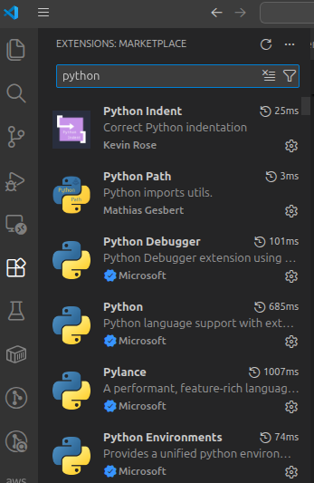

# VSCode setup

This guide explains how to install and configure VS Code and tailor it for development within the FDRI project.

## Installing VSCode

[Download][download_vscode_link] and install VSCode to your local or virtual machine.

## Essentials

Some FDRI repositories require use of Git, Docker, Localstack and AWS.

If you are working inside a managed virtual machine or otherwise, see the **VMWare-Setup-Guide.md** on how to:

- install Git
- install Docker
- install Localstack CLI
- set up AWS Vault

All of these steps can be performed inside the VS Code integrated terminal.

## VS Code Extensions

To install extensions:

1. Open VS Code and click on the **Extensions** icon in the left-hand sidebar:

2. Search for and install Microsoft-maintained extensions (look for the official blue tick).

3. Click **Install** on the extension's page to add it to your VS Code setup.

## Hyperlinks

[download_vscode_link]: https://code.visualstudio.com/download

