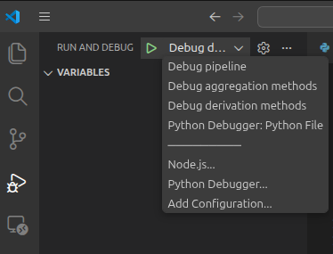

# Debugging in VS Code

**Note:** All examples in this document use **Python**, but the same general workflow applies to other programming languages supported by VS Code.

To open the debugger, click the **Run and Debug** icon in the left-hand sidebar.  
At the top of the debug panel, choose a debug configuration from the drop‑down menu.



If Python is installed and VS Code is configured for Python development, the default configuration will typically be: **Python Debugger: Python File**. This option lets you debug a single `.py` file and may be the only option available until you create additional debug configurations.


## Extensions

To enable Python debugging in VS Code, install the **Python Debugger** extension. See `VSCode_setup.md` for instructions on installing extensions.


## Debugging Multiple Files (Workflows / Pipelines)

Some projects require debugging workflows that span multiple `.py` files. To enable this, you must create custom debug configurations, following the steps below:

1. In your project root, create a `.vscode` folder if it doesn't already exist.
2. Add `.vscode/` to your `.gitignore` unless you explicitly want to share debug configurations with others.
3. Inside the `.vscode` folder, create a file named `launch.json` (if it does not already exist).
4. Add one or more debug configurations inside `launch.json`.  
   Example configurations can be added based on your project's structure.
5. After saving `launch.json`, your configurations will automatically appear in the debug configuration drop‑down menu (see figure above).
6. Select a configuration and click the **Run** button to start the debugger.


> Example: Configuration to debug a `pytest` unit test

Command that gets run from root directory:

`pytest tests/dritimeseriesprocessor/operations/aggregation/test_aggregation_methods.py`

Corresponding debug configuration:

```bash
    {
        "version": "0.2.0",
        "configurations": [
            {
                "name": "Debug aggregation methods",
                "type": "debugpy",
                "request": "launch",
                "module": "pytest",
                "console": "integratedTerminal", 
                "args": [
                    "tests/dritimeseriesprocessor/operations/aggregation/test_aggregation_methods.py"
                ],
                "console": "integratedTerminal",
                "justMyCode": false
            }
        ]
    }
```


> Example: Configuration to debug the dri-timeseries-processor pipeline. 

Command that gets run from root directory: 

`python -m dritimeseriesprocessor from-selection --netowrk cosmos --end-data 2020-08-20 --selection cosmos-holln PE P1D`

Corresponding debug configuration:

```bash
    {
        "version": "0.2.0",
        "configurations": [
            {
                "name": "Debug pipeline",
                "type": "debugpy",
                "request": "launch",
                "module": "dritimeseriesprocessor",
                "console": "integratedTerminal", 
                "args": [
                    "from-selection",
                    "--network", "cosmos",
                    "--end-date", "2020-08-20",
                    "--selection", "cosmos-holln", "PE", "P1D"
                ],
                "justMyCode": false
            }
        ]
    }
```


# Using the Debugger

When the debugger is active, you can open the **Debug Console** by:

- Clicking the button with three dots next to the configuration drop‑down menu, or
- Selecting the **DEBUG CONSOLE** tab beside the integrated VS Code terminal.

You can then inspect variables, evaluate expressions, or print output during a debugging session.

This document assumes familiarity with basic debugging controls:

- **Continue / Play**
- **Step Over**
- **Step Into**
- **Step Out**
- **Restart**
- **Stop**

If you are new to these controls, VS Code’s built‑in tooltips provide helpful explanations when you hover over each button.

